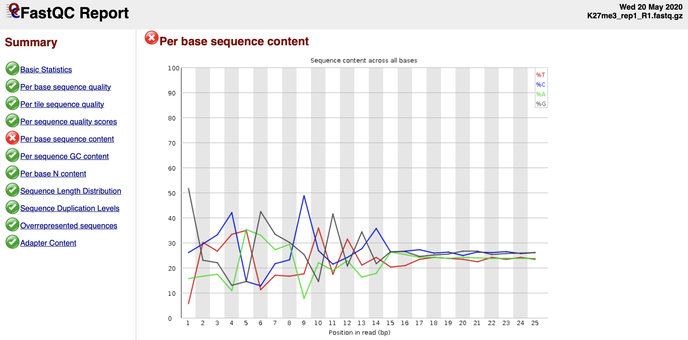
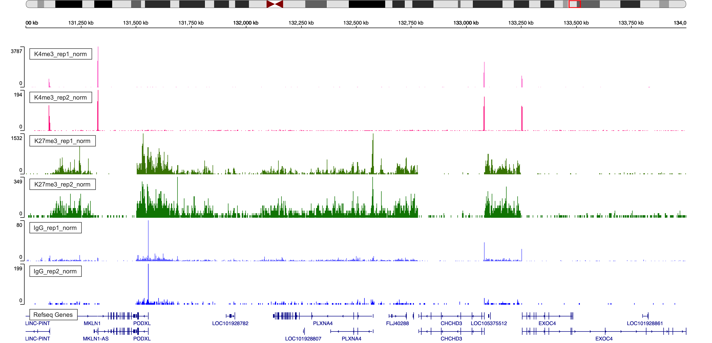
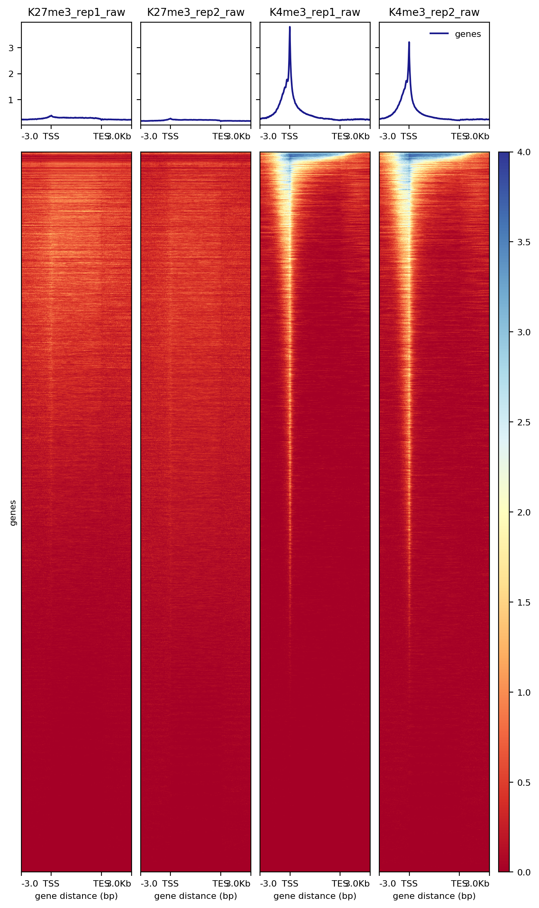

<!-- --- -->
<!-- title: "CUT&Tag Data Processing and Analysis Tutorial" -->
<!-- author: "Ye Zheng" -->
<!-- output: -->
<!--   html_document: -->
<!--     toc: true -->
<!--     toc_float: true -->
<!--     #number_sections: false -->
<!--     code_folding: show -->
<!-- editor_options: -->
<!--   chunk_output_type: console -->
<!-- --- -->

<!-- <style> -->
<!-- body{text-align: justify} -->
<!-- pre code, pre, code { -->
<!--   white-space: pre !important; -->
<!--   overflow-x: scroll !important; -->
<!--   word-break: keep-all !important; -->
<!--   word-wrap: initial !important; -->
<!-- } -->
<!-- </style> -->
*contact: yzheng23@fredhutch.org*

*File creation: March 13, 2020*  

*Update: Aug 10, 2020* 

**Approximate time: 60 - 120 minutes**

```{r setup, include=FALSE, dev="CairoPNG"}
knitr::opts_chunk$set(echo = TRUE, dev="CairoPNG", out.width = "100%")#, cache=TRUE)
```


# I. Introduction

## 1.1. Overview of CUT&Tag 
 
All dynamic processes that take place on DNA in the eukaryotic nucleus occur in the context of a chromatin landscape that comprises nucleosomes and their modifications, transcription factors, and chromatin-associated complexes. A variety of chromatin features mark sites of activating and silencing transcriptional regulatory elements and chromatin domains that differ between cell types and change during development. 

The mapping of chromatin features genome-wide has traditionally been performed using chromatin immunoprecipitation (ChIP), in which chromatin is cross-linked and solubilized, and an antibody to a protein or modification of interest is used to immunoprecipitate the bound DNA (Fig. 1a). Very little has changed in the way ChIP is most generally performed since it was first described 35 years ago, and remains fraught with signal-to-noise issues and artifacts. An alternative chromatin profiling strategy is enzyme tethering in situ whereby the chromatin protein or modification of interest is targeted by an antibody or fusion protein. Then, the underlying DNA is marked or cleaved, and a succession of enzyme-tethering methods have been introduced over the past two decades. Cleavage Under Targets & Tagmentation (CUT&Tag) is a tethering method that uses a protein-A-Tn5 (pA-Tn5) transposome fusion protein (Fig. 1b). In CUT&Tag, permeabilized cells or nuclei are incubated with antibody to a specified chromatin protein, and then pA-Tn5 loaded with mosaic end adaptors is successively tethered to antibody-bound sites. Activation of the transposome by adding magnesium ions results in the integration of the adaptors into nearby DNA. These are then amplified to generate sequencing libraries. Antibody-tethered Tn5-based methods achieve high sensitivity owing to stringent washing of samples after pA-Tn5 tethering and the high efficiency of adaptor integration. The improved signal-to-noise relative to ChIP-seq translates to an order-of-magnitude reduction in the amount of sequencing required to map chromatin features, allowing sample pooling (typically up to 90 samples) for paired-end sequencing on Illumina NGS sequencers by barcoded PCR of libraries.
 


## 1.2. Objectives

This tutorial is designed for processing and analyzing CUT&Tag data following the [Bench top CUT&Tag V.3 protocol](https://www.protocols.io/view/bench-top-cut-amp-tag-bcuhiwt6/abstract).  The illustration data used in this tutorial is the profiling of histone modifications in the human lymphoma K562 cell line, but the tutorial is generally applicable to any chromatin protein, including transcription factors, RNA polymerase II, and epitope-tagged proteins.

## 1.3 CUT&Tag data processing and analysis outline.


## 1.4. Requirements

- Linux system

- R (versions >= 3.6)
  - dplyr
  - stringr
  - ggplot2
  - viridis
  - GenomicRanges
  - chromVAR
  - DESeq2
  - ggpubr
  - corrplot
  - ChIPseqSpikeInFree [Optional]
  
```{r echo=TRUE, eval=TRUE, message=FALSE, warning=FALSE}
library(dplyr)
library(stringr)
library(ggplot2)
library(viridis)
library(GenomicRanges)
library(chromVAR) ## For FRiP analysis and differential analysis
library(DESeq2) ## For differential analysis section
library(ggpubr) ## For customizing figures
library(corrplot) ## For correlation plot
```

- FastQC(version >= 0.11.9)

- Bowtie2 (version >= 2.3.4.3)

- samtools (version >= 1.10)

- bedtools (version >= 2.29.1)

- Picard (version >= 2.18.29)

- SEACR (version >= 1.3)

- deepTools (version >= 2.0)
 
## 1.5. Data Downloading

In this tutorial, we use data from Kaya-Okur et al. (2020), and available for downloading from [GEO](https://www.ncbi.nlm.nih.gov/geo/). The corresponding SRA entries are provided below.

Options to download SRA sequences from GEO: 

- a. Using [SRA Toolkit](https://www.ncbi.nlm.nih.gov/sra/docs/sradownload/)

- b. Download through [European Nucleotide Archive](file:///Users/yezheng/Downloads/downloading_fastq_GEO.pdf). New ENA Browser: https://www.ebi.ac.uk/ena/browser/view. We are using this option as illustration.

First, we need to specify the project path.

```{r, engine = 'bash', eval = FALSE}
##== linux command ==##
projPath="/path/to/project/where/data/and/results/are/saved"
```


- H3K27me3: 
  - SH_Hs_K27m3_NX_0918 as replicate 1: GEO accession: GSE145187, SRA entry: SRX8754646
  - SH_Hs_K27m3_Xpc_0107 as replicate 2: GEO accession: GSE145187, SRA entry: SRX7713678

- H3K4me3:
  - SH_Hs_K4m3_NX_0918 as replicate 1: GEO accession: GSE145187, SRA entry: SRX7713692
  - SH_Hs_K4m3_Xpc_0107 as replicate 2: GEO accession: GSE145187, SRA entry: SRX7713696


- IgG:
  - SH_Hs_IgG_1x_0924 as replicate 1:GEO accession: GSE145187, SRA entry: SRX8468909
  - SH_Hs_IgG_20181224 as replicate 2: GEO accession: GSM3680227, SRA entry: SRX5545346

Taking SH_Hs_IgG_20181224 as an example.
```{r, engine = 'bash', eval = FALSE}
##== linux command ==##
wget -O $projPath/data/IgG_rep2/IgG_rep2_R1_001.fastq.gz ftp://ftp.sra.ebi.ac.uk/vol1/fastq/SRR875/001/SRR8754611/SRR8754611_1.fastq.gz

wget -O $projPath/data/IgG_rep2/IgG_rep2_R2_001.fastq.gz ftp://ftp.sra.ebi.ac.uk/vol1/fastq/SRR875/001/SRR8754611/SRR8754611_2.fastq.gz

wget -O $projPath/data/IgG_rep2/IgG_rep2_R1_002.fastq.gz ftp://ftp.sra.ebi.ac.uk/vol1/fastq/SRR875/002/SRR8754612/SRR8754612_1.fastq.gz

wget -O $projPath/data/IgG_rep2/IgG_rep2_R2_002.fastq.gz ftp://ftp.sra.ebi.ac.uk/vol1/fastq/SRR875/002/SRR8754612/SRR8754612_2.fastq.gz
```


# II. Data Pre-processing

## 2.1. Quality Control using [FastQC](https://www.bioinformatics.babraham.ac.uk/projects/fastqc/) [Optional]

This step is not required. In case that users are generating their own data and FastQC is one of the routine checking procedures in users' group, we provide this step as troubleshoting explanation.

### 2.2.1 Obtain FastQC
```{r, engine = 'bash', eval = FALSE}
##== linux command ==##
mkdir -p $projPath/tools
wget -P $projPath/tools https://www.bioinformatics.babraham.ac.uk/projects/fastqc/fastqc_v0.11.9.zip
cd $projPath/tools
unzip fastqc_v0.11.9.zip
```

### 2.2.2 Run FastQC for quality check
```{r, engine = 'bash', eval = FALSE}
##== linux command ==##
mkdir -p ${projPath}/fastqFileQC/${histName}

$projPath/tools/FastQC/fastqc -o ${projPath}/fastqFileQC/${histName} -f fastq ${projPath}/fastq/${histName}_R1.fastq.gz
$projPath/tools/FastQC/fastqc -o ${projPath}/fastqFileQC/${histName} -f fastq ${projPath}/fastq/${histName}_R2.fastq.gz
```

### 2.2.3 Intepret the quality check results.

Quality check reference: [https://www.bioinformatics.babraham.ac.uk/projects/fastqc/bad_sequence_fastqc.html](https://www.bioinformatics.babraham.ac.uk/projects/fastqc/bad_sequence_fastqc.html)




**The discordant sequence content at the begining of the reads are common phenomenon for CUT&Tag reads. Failing to pass the Per base seuqnence content does not mean your data failed.**

- It can be due to the Tn5 preference.

- What you might be detecting is the 10-bp periodicity that shows up as a sawtooth pattern in the length distribution. If so, this is normal and will not affect alignment or peak calling. In any case we do not recommend trimming as the bowtie2 parameters that we list will give accurate mapping information without trimming.

## 2.2. Merge technical replicates/lanes if needed [Optional]

Sometimes, samples are often sequenced across multiple lanes for efficiency and can be pooled before alignment. If you want to check the reproducibility between sequences of different lanes of the same sample, you can skip this step and align each sequencing file (fastq file) respectively.

```{r, engine = 'bash', eval = FALSE}
##== linux command ==##
histName="K27me3_rep1"

mkdir -p ${projPath}/fastq
cat ${projPath}/data/${histName}/*_R1_*.fastq.gz >${projPath}/fastq/${histName}_R1.fastq.gz
cat ${projPath}/data/${histName}/*_R2_*.fastq.gz >${projPath}/fastq/${histName}_R2.fastq.gz
```


# III. Alignment

 
## 3.1. Bowtie2 alignment [required]


The structure of CUT&Tag insert libraries with Tn5 adapters and barcoded PCR primers  is shown below:


Our standard pipeline is to perform single-index 25x25 PE Illumina sequencing on up to 90 pooled samples on a single HiSeq 2500 flowcell, where each sample has a unique PCR primer barcode. Amounts for each library are adjusted to provide ~5 million paired-end reads, which provides high-quality profiling for abundant chromatin features with a specific and high-yield antibody. Less abundant features typically require fewer reads, while lower-quality antibodies may increase the number of reads needed for generating robust chromatin profiles. A thorough discussion of feature recall and sequencing depths for CUT&Tag has been published (Kaya-Okur et al 2020).

### 3.1.1 Alignment to HG38. 

```{r, engine = 'bash', eval = FALSE}
##== linux command ==##
cores=8
ref="/path/to/bowtie2Index/hg38"

mkdir -p ${projPath}/alignment/sam/bowtie2_summary
mkdir -p ${projPath}/alignment/bam
mkdir -p ${projPath}/alignment/bed
mkdir -p ${projPath}/alignment/bedgraph

## Build the bowtie2 reference genome index if needed:
## bowtie2-build path/to/hg38/fasta/hg38.fa /path/to/bowtie2Index/hg38

bowtie2 --end-to-end --very-sensitive --no-mixed --no-discordant --phred33 -I 10 -X 700 -p ${cores} -x ${ref} -1 ${projPath}/fastq/${histName}_R1.fastq.gz -2 ${projPath}/fastq/${histName}_R2.fastq.gz -S ${projPath}/alignment/sam/${histName}_bowtie2.sam &> ${projPath}/alignment/sam/bowtie2_summary/${histName}_bowtie2.txt
```

The paired-end reads are aligned by Bowtie2 using parameters ```--end-to-end --very-sensitive --no-mixed --no-discordant --phred33 -I 10 -X 700``` for mapping of inserts 10-700 bp in length. 

**Critical step**: There is no need to trim reads from out standard 25x25 PE sequencing, as adapter sequences will not be included in reads of inserts >25 bp. However, for users performing longer sequencing, reads will need to be trimmed by Cutadapt and mapped by ```--local --very-sensitive --no-mixed --no-discordant --phred33 -I 10 -X 700``` to ignore any remaining adapter sequence at the 3' ends of reads during mapping.
 

### 3.1.2 Alignment to spike-in genome for spike-in calibration [optional/recommended]

This section is **optional** but **recommended** depending on your experimental protocol.

E. coli DNA is carried along with bacterially-produced pA-Tn5 protein and gets tagmented non-specifically during the reaction. The fraction of total reads that map to the E.coli genome depends on the yield of epitope-targeted CUT&Tag, and so depends on the number of cells used and the abundance of that epitope in chromatin. Since a constant amount of pATn5 is added to CUT&Tag reactions and brings along a fixed amount of E. coli DNA, E. coli reads can be used to normalize epitope abundance in a set of experiments. More discussion, please see Section V.

```{r, engine = 'bash', eval = FALSE}
##== linux command ==##
spikeInRef="/shared/ngs/illumina/henikoff/Bowtie2/Ecoli"
chromSize="/fh/fast/gottardo_r/yezheng_working/SupplementaryData/hg38/chromSize/hg38.chrom.size"

## bowtie2-build path/to/Ecoli/fasta/Ecoli.fa /path/to/bowtie2Index/Ecoli
bowtie2 --end-to-end --very-sensitive --no-mixed --no-discordant --phred33 -I 10 -X 700 -p ${cores} -x ${spikeInRef} -1 ${projPath}/fastq/${histName}_R1.fastq.gz -2 ${projPath}/fastq/${histName}_R2.fastq.gz -S $projPath/alignment/sam/${histName}_bowtie2_spikeIn.sam &> $projPath/alignment/sam/bowtie2_summary/${histName}_bowtie2_spikeIn.txt

seqDepthDouble=`samtools view -F 0x04 $projPath/alignment/sam/${histName}_bowtie2_spikeIn.sam | wc -l`
seqDepth=$((seqDepthDouble/2))
echo $seqDepth >$projPath/alignment/sam/bowtie2_summary/${histName}_bowtie2_spikeIn.seqDepth

```

- For spike-in normalization, reads are aligned to the E. coli genome U00096.3 with two more parameters ```--no-overlap``` and ```--no-dovetail``` (```--end-to-end --very-sensitive --no-overlap --no-dovetail --no-mixed --no-discordant --phred33 -I 10 -X 700```) to avoid possible cross-mapping of the experimental genome to that of the carry-over E. coli DNA that is used for calibration.

### 3.1.3 Alignment summary

For more detailed parameters explanation, users can refer to the [bowite2 manual](http://bowtie-bio.sourceforge.net/bowtie2/manual.shtml).

Bowtie2 alignment results summary is saved at ```${projPath}/alignment/sam/bowtie2)summary/${histName}_bowtie2.txt``` and you should expect the results look similar.

```
2984630 reads; of these:
  2984630 (100.00%) were paired; of these:
    125110 (4.19%) aligned concordantly 0 times
    2360430 (79.09%) aligned concordantly exactly 1 time
    499090 (16.72%) aligned concordantly >1 times
95.81% overall alignment rate
```

- 2984640 is the sequencing depth, i.e., total number of paired reads.
- 125110 is the number of read pairs that fail to be mapped.
- 2360430 + 499090 is the number of read paris that are successfully mapped.
- 95.81% is the overall alignment rate

## 3.2 Report sequencing mapping summary [required]

Summarize the raw reads and uniquely mapping reads to report the efficiency of alignment. Alignment frequencies are expected to be >80% for high-quality data. CUT&Tag data typically has very low backgrounds, so as few as 1 million mapped fragments can give robust profiles for a histone modification in the human genome. Profiling of less-abundant transcription factors and chromatin proteins may require 10 times as many mapped fragments for downstream analysis.

We can evaluate the following metrics:

 - Sequencing depth
 - Alignment rate
 - Number of mappable fragments
 - Duplication rate
 - Unique library size
 - Fragment size distribution

### 3.2.1 Sequencing depth

```{r echo=TRUE, eval = TRUE, message=FALSE, warning=FALSE, fig.width=10, fig.height=8, out.width = "100%"}
##=== R command ===## 
## Path to the project and histone list
projPath = "/fh/fast/gottardo_r/yezheng_working/cuttag/CUTTag_tutorial"
sampleList = c("K27me3_rep1", "K27me3_rep2", "K4me3_rep1", "K4me3_rep2", "IgG_rep1", "IgG_rep2")
histList = c("K27me3", "K4me3", "IgG")

## Collect the alignment results from the bowtie2 alignment summary files
alignResult = c()
for(hist in sampleList){
  alignRes = read.table(paste0(projPath, "/alignment/sam/bowtie2_summary/", hist, "_bowtie2.txt"), header = FALSE, fill = TRUE)
  alignRate = substr(alignRes$V1[6], 1, nchar(as.character(alignRes$V1[6]))-1)
  histInfo = strsplit(hist, "_")[[1]]
  alignResult = data.frame(Histone = histInfo[1], Replicate = histInfo[2], 
                           SequencingDepth = alignRes$V1[1] %>% as.character %>% as.numeric, 
                           MappedFragNum_hg38 = alignRes$V1[4] %>% as.character %>% as.numeric + alignRes$V1[5] %>% as.character %>% as.numeric, 
                           AlignmentRate_hg38 = alignRate %>% as.numeric)  %>% rbind(alignResult, .)
}
alignResult$Histone = factor(alignResult$Histone, levels = histList)
alignResult %>% mutate(AlignmentRate_hg38 = paste0(AlignmentRate_hg38, "%"))
```


### 3.2.2 Spike-in alignment 
```{r echo=TRUE, eval = TRUE, message=FALSE, warning=FALSE, fig.width=10, fig.height=8}
##=== R command ===## 
spikeAlign = c()
for(hist in sampleList){
  spikeRes = read.table(paste0(projPath, "/alignment/sam/bowtie2_summary/", hist, "_bowtie2_spikeIn.txt"), header = FALSE, fill = TRUE)
  alignRate = substr(spikeRes$V1[6], 1, nchar(as.character(spikeRes$V1[6]))-1)
  histInfo = strsplit(hist, "_")[[1]]
  spikeAlign = data.frame(Histone = histInfo[1], Replicate = histInfo[2], 
                          SequencingDepth = spikeRes$V1[1] %>% as.character %>% as.numeric, 
                          MappedFragNum_spikeIn = spikeRes$V1[4] %>% as.character %>% as.numeric + spikeRes$V1[5] %>% as.character %>% as.numeric, 
                          AlignmentRate_spikeIn = alignRate %>% as.numeric)  %>% rbind(spikeAlign, .)
}
spikeAlign$Histone = factor(spikeAlign$Histone, levels = histList)
spikeAlign %>% mutate(AlignmentRate_spikeIn = paste0(AlignmentRate_spikeIn, "%"))
```

### 3.2.3 Summarize the alignment to hg38 and E.coli
```{r echo=TRUE, eval = TRUE, message=FALSE, warning=FALSE}
##=== R command ===## 
alignSummary = left_join(alignResult, spikeAlign, by = c("Histone", "Replicate", "SequencingDepth")) %>%
  mutate(AlignmentRate_hg38 = paste0(AlignmentRate_hg38, "%"), 
         AlignmentRate_spikeIn = paste0(AlignmentRate_spikeIn, "%"))
alignSummary
```

### 3.2.4 Visualizing the sequencing depth and alignment results.
```{r echo=TRUE, eval = TRUE, message=FALSE, warning=FALSE, fig.width=12, fig.height=8}
##=== R command ===## 
## Generate sequencing depth boxplot
fig3A = alignResult %>% ggplot(aes(x = Histone, y = SequencingDepth/1000000, fill = Histone)) +
    geom_boxplot() +
    geom_jitter(aes(color = Replicate), position = position_jitter(0.15)) +
    scale_fill_viridis(discrete = TRUE, begin = 0.1, end = 0.9, option = "magma", alpha = 0.8) +
    scale_color_viridis(discrete = TRUE, begin = 0.1, end = 0.9) +
    theme_bw(base_size = 18) +
    ylab("Sequencing Depth per Million") +
    xlab("") + 
    ggtitle("A. Sequencing Depth")

fig3B = alignResult %>% ggplot(aes(x = Histone, y = MappedFragNum_hg38/1000000, fill = Histone)) +
    geom_boxplot() +
    geom_jitter(aes(color = Replicate), position = position_jitter(0.15)) +
    scale_fill_viridis(discrete = TRUE, begin = 0.1, end = 0.9, option = "magma", alpha = 0.8) +
    scale_color_viridis(discrete = TRUE, begin = 0.1, end = 0.9) +
    theme_bw(base_size = 18) +
    ylab("Mapped Fragments per Million") +
    xlab("") +
    ggtitle("B. Alignable Fragment (hg38)")

fig3C = alignResult %>% ggplot(aes(x = Histone, y = AlignmentRate_hg38, fill = Histone)) +
    geom_boxplot() +
    geom_jitter(aes(color = Replicate), position = position_jitter(0.15)) +
    scale_fill_viridis(discrete = TRUE, begin = 0.1, end = 0.9, option = "magma", alpha = 0.8) +
    scale_color_viridis(discrete = TRUE, begin = 0.1, end = 0.9) +
    theme_bw(base_size = 18) +
    ylab("% of Mapped Fragments") +
    xlab("") +
    ggtitle("C. Alignment Rate (hg38)")

fig3D = spikeAlign %>% ggplot(aes(x = Histone, y = AlignmentRate_spikeIn, fill = Histone)) +
    geom_boxplot() +
    geom_jitter(aes(color = Replicate), position = position_jitter(0.15)) +
    scale_fill_viridis(discrete = TRUE, begin = 0.1, end = 0.9, option = "magma", alpha = 0.8) +
    scale_color_viridis(discrete = TRUE, begin = 0.1, end = 0.9) +
    theme_bw(base_size = 18) +
    ylab("Spike-in Alignment Rate") +
    xlab("") +
    ggtitle("D. Alignment Rate (E.coli)")

ggarrange(fig3A, fig3B, fig3C, fig3D, ncol = 2, nrow=2, common.legend = TRUE, legend="bottom")
```

In a typical CUT&Tag experiment targeting the abundant H3K27me3 histone modification in 65,000 K562 cells, the percentage of E. coli reads range from ~0.01% to 10%. With fewer cells or less abundant epitopes, E. coli reads can comprise as much as 70% or the total mapped reads. For IgG controls, the percentage of E. coli reads is typically much higher than that for an abundant histone modification.


## 3.3. Remove duplicates [optional/required] 

CUT&Tag integrates adapters into DNA in the vicinity of the antibody-tethered pA-Tn5, and the exact sites of integration are affected by the accessibility of surrounding DNA. For this reason fragments that share exact starting and ending positions are expected to be common, and such ‘duplicates’ may not be due to duplication during PCR. In practice, we have found that the apparent duplication rate is low for high quality CUT&Tag datasets, and even the apparent ‘duplicate’ fragments are likely to be true fragments. Thus, we do not recommend removing the duplicates. In experiments with very small amounts of material or where PCR duplication is suspected, duplicates can be removed. The following commands show how to check the duplication rate using [Picard](https://broadinstitute.github.io/picard/).

```{r, engine = 'bash', eval = FALSE}
##== linux command ==##
## depending on how you load picard and your server environment, the picardCMD can be different. Adjust accordingly.
picardCMD="java -jar picard.jar"
mkdir -p $projPath/alignment/removeDuplicate/picard_summary

## Sort by coordinate
$picardCMD SortSam I=$projPath/alignment/sam/${histName}_bowtie2.sam O=$projPath/alignment/sam/${histName}_bowtie2.sorted.sam SORT_ORDER=coordinate

## mark duplicates
$picardCMD MarkDuplicates I=$projPath/alignment/sam/${histName}_bowtie2.sorted.sam O=$projPath/alignment/removeDuplicate/${histName}_bowtie2.sorted.dupMarked.sam METRICS_FILE=$projPath/alignment/removeDuplicate/picard_summary/${histName}_picard.dupMark.txt

## remove duplicates
picardCMD MarkDuplicates I=$projPath/alignment/sam/${histName}_bowtie2.sorted.sam O=$projPath/alignment/removeDuplicate/${histName}_bowtie2.sorted.rmDup.sam REMOVE_DUPLICATES=true METRICS_FILE=$projPath/alignment/removeDuplicate/picard_summary/${histName}_picard.rmDup.txt
```


We summarize the apparent duplication rate and calculate the unique library size without duplicates. 

```{r echo=TRUE, eval = TRUE, message=FALSE, warning=FALSE}
##=== R command ===## 
## Summarize the duplication information from the picard summary outputs.
dupResult = c()
for(hist in sampleList){
  dupRes = read.table(paste0(projPath, "/alignment/removeDuplicate/picard_summary/", hist, "_picard.rmDup.txt"), header = TRUE, fill = TRUE)
  
  histInfo = strsplit(hist, "_")[[1]]
  dupResult = data.frame(Histone = histInfo[1], Replicate = histInfo[2], MappedFragNum_hg38 = dupRes$READ_PAIRS_EXAMINED[1] %>% as.character %>% as.numeric, DuplicationRate = dupRes$PERCENT_DUPLICATION[1] %>% as.character %>% as.numeric * 100, EstimatedLibrarySize = dupRes$ESTIMATED_LIBRARY_SIZE[1] %>% as.character %>% as.numeric) %>% mutate(UniqueFragNum = MappedFragNum_hg38 * (1-DuplicationRate/100))  %>% rbind(dupResult, .)
}
dupResult$Histone = factor(dupResult$Histone, levels = histList)
alignDupSummary = left_join(alignSummary, dupResult, by = c("Histone", "Replicate", "MappedFragNum_hg38")) %>% mutate(DuplicationRate = paste0(DuplicationRate, "%"))
alignDupSummary
```


- In these example datasets, the IgG control samples have relatively high duplication rates, since reads in this sample derive from non-specific tagmentation in the CUT&Tag reactions. Therefore, it is appropriate to remove the duplicates from the IgG datasets before downstream analysis. 

- The estimated library size are the estimated number of unique molecules in the library based on PE duplication calculated by Picard.

- The estimated library sizes is proportional to the abundance of the targeted epitope and to the quality of the antibody used, while the estimated library sizes of IgG samples are expected to be very low.

- Unique fragment number is calculated by the MappedFragNum_hg38 * (1-DuplicationRate/100).

```{r echo=TRUE, eval = TRUE, message=FALSE, warning=FALSE, fig.width=13, fig.height=8}
##=== R command ===## 
## generate boxplot figure for the  duplication rate
fig4A = dupResult %>% ggplot(aes(x = Histone, y = DuplicationRate, fill = Histone)) +
    geom_boxplot() +
    geom_jitter(aes(color = Replicate), position = position_jitter(0.15)) +
    scale_fill_viridis(discrete = TRUE, begin = 0.1, end = 0.9, option = "magma", alpha = 0.8) +
    scale_color_viridis(discrete = TRUE, begin = 0.1, end = 0.9) +
    theme_bw(base_size = 18) +
    ylab("Duplication Rate (*100%)") +
    xlab("") 

fig4B = dupResult %>% ggplot(aes(x = Histone, y = EstimatedLibrarySize, fill = Histone)) +
    geom_boxplot() +
    geom_jitter(aes(color = Replicate), position = position_jitter(0.15)) +
    scale_fill_viridis(discrete = TRUE, begin = 0.1, end = 0.9, option = "magma", alpha = 0.8) +
    scale_color_viridis(discrete = TRUE, begin = 0.1, end = 0.9) +
    theme_bw(base_size = 18) +
    ylab("Estimated Library Size") +
    xlab("") 

fig4C = dupResult %>% ggplot(aes(x = Histone, y = UniqueFragNum, fill = Histone)) +
    geom_boxplot() +
    geom_jitter(aes(color = Replicate), position = position_jitter(0.15)) +
    scale_fill_viridis(discrete = TRUE, begin = 0.1, end = 0.9, option = "magma", alpha = 0.8) +
    scale_color_viridis(discrete = TRUE, begin = 0.1, end = 0.9) +
    theme_bw(base_size = 18) +
    ylab("# of Unique Fragments") +
    xlab("")

ggarrange(fig4A, fig4B, fig4C, ncol = 3, common.legend = TRUE, legend="bottom")
```


## 3.4. Assess mapped fragment size distribution [Required]

CUT&Tag inserts adapters on either side of chromatin particles in the vicinity of the tethered enzyme, although tagmentation within chromatin particles can also occur. So, CUT&Tag reactions targeting a histone modification predominantly results in fragments that are nucleosomal lengths (~180 bp), or multiples of that length. CUT&Tag targeting transcription factors predominantly produce nucleosome-sized fragments and variable amounts of shorter fragments, from neighboring nucleosomes and the factor-bound site, respectively. Tagmentation  of DNA on the surface of nucleosomes also occurs, and plotting fragment lengths with single-basepair resolution reveal a 10-bp sawtooth periodicity, which is typical of successful CUT&Tag experiments.

```{r, engine = 'bash', eval = FALSE}
##== linux command ==##
mkdir -p $projPath/alignment/sam/fragmentLen

## Extract the 9th column from the alignment sam file which is the fragment length
samtools view -F 0x04 $projPath/alignment/sam/${histName}_bowtie2.sam | awk -F'\t' 'function abs(x){return ((x < 0.0) ? -x : x)} {print abs($9)}' | sort | uniq -c | awk -v OFS="\t" '{print $2, $1/2}' >$projPath/alignment/sam/fragmentLen/${histName}_fragmentLen.txt
```

```{r echo=TRUE, eval = TRUE, message=FALSE, warning=FALSE, fig.width=15, fig.height=8}
##=== R command ===## 
## Collect the fragment size information
fragLen = c()
for(hist in sampleList){
  
  histInfo = strsplit(hist, "_")[[1]]
  fragLen = read.table(paste0(projPath, "/alignment/sam/fragmentLen/", hist, "_fragmentLen.txt"), header = FALSE) %>% mutate(fragLen = V1 %>% as.numeric, fragCount = V2 %>% as.numeric, Weight = as.numeric(V2)/sum(as.numeric(V2)), Histone = histInfo[1], Replicate = histInfo[2], sampleInfo = hist) %>% rbind(fragLen, .) 
}
fragLen$sampleInfo = factor(fragLen$sampleInfo, levels = sampleList)
fragLen$Histone = factor(fragLen$Histone, levels = histList)
## Generate the fragment size density plot (violin plot)
fig5A = fragLen %>% ggplot(aes(x = sampleInfo, y = fragLen, weight = Weight, fill = Histone)) +
    geom_violin(bw = 5) +
    scale_y_continuous(breaks = seq(0, 800, 50)) +
    scale_fill_viridis(discrete = TRUE, begin = 0.1, end = 0.9, option = "magma", alpha = 0.8) +
    scale_color_viridis(discrete = TRUE, begin = 0.1, end = 0.9) +
    theme_bw(base_size = 20) +
    ggpubr::rotate_x_text(angle = 20) +
    ylab("Fragment Length") +
    xlab("")

fig5B = fragLen %>% ggplot(aes(x = fragLen, y = fragCount, color = Histone, group = sampleInfo, linetype = Replicate)) +
  geom_line(size = 1) +
  scale_color_viridis(discrete = TRUE, begin = 0.1, end = 0.9, option = "magma") +
  theme_bw(base_size = 20) +
  xlab("Fragment Length") +
  ylab("Count") +
  coord_cartesian(xlim = c(0, 500))

ggarrange(fig5A, fig5B, ncol = 2)

```

- The smaller fragments (50-100 bp) can be due to that tethered Tn5 can tagment on the surface of a nucleosome as well as in linker regions, so the small fragments might not be background.

## 3.5 Assess replicate reproducibility

Data reproducibility between replicates is assessed by correlation analysis of mapped read counts across the genome. For the simplicity of implementation, we will postpone this analysis after Section IV when the file format has been converted into fragment bed files.


# IV. Alignment results filtering and file format conversion

## 4.1 Filtering mapped reads by the mapping quality filtering [optinal]

Some project may require more stringent filtering on the alignment quality score. This [blog](http://biofinysics.blogspot.com/2014/05/how-does-bowtie2-assign-mapq-scores.html) detailedly discussed how does bowtie assign quality score with examples.

MAPQ(x) = -10 * $log_{10}$(P(x is mapped wrongly)) = -10 * $log_{10}(p)$

which ranges from 0 to 37, 40 or 42.

```samtools view -q minQualityScore``` will eliminate all the alignment results that are below the minQualityScore defined by user.
```{r, engine = 'bash', eval = FALSE}
##== linux command ==##
minQualityScore=2
samtools view -q $minQualityScore ${projPath}/alignment/sam/${histName}_bowtie2.sam >${projPath}/alignment/sam/${histName}_bowtie2.qualityScore$minQualityScore.sam
```

- If you do implement this filtering, please replace the ```${histName}_bowtie2.sam``` in the following steps by this filtered sam file ```${histName}_bowtie2.qualityScore$minQualityScore.sam```.

## 4.2 File format conversion [required]

This section is **required** in preparation for the peak calling and visualization where there are a few filtering and file format conversion that need to be done.

```{r, engine = 'bash', eval = FALSE}
##== linux command ==##
## Filter and keep the mapped read pairs
samtools view -bS -F 0x04 $projPath/alignment/sam/${histName}_bowtie2.sam >$projPath/alignment/bam/${histName}_bowtie2.mapped.bam

## Convert into bed file format
bedtools bamtobed -i $projPath/alignment/bam/${histName}_bowtie2.mapped.bam -bedpe >$projPath/alignment/bed/${histName}_bowtie2.bed

## Keep the read pairs that are on the same chromosome and fragment length less than 1000bp.
awk '$1==$4 && $6-$2 < 1000 {print $0}' $projPath/alignment/bed/${histName}_bowtie2.bed >$projPath/alignment/bed/${histName}_bowtie2.clean.bed

## Only extract the fragment related columns
cut -f 1,2,6 $projPath/alignment/bed/${histName}_bowtie2.clean.bed | sort -k1,1 -k2,2n -k3,3n  >$projPath/alignment/bed/${histName}_bowtie2.fragments.bed
```

## 4.3 Assess replicate reproducibility (continue section 3.5)

To study the reproducibility between replicates and across conditions, the genome is split into 500 bp bins, and a Pearson correlation of the log2-transformed values of read counts in each bin is calculated between replicate datasets. Multiple replicates and IgG control datasets are displayed in a hierarchically clustered correlation matrix. 


```{r, engine = 'bash', eval = FALSE}
##== linux command ==##
## We use the mid point of each fragment to infer which 500bp bins does this fragment belong to.
binLen=500
awk -v w=$binLen '{print $1, int(($2 + $3)/(2*w))*w + w/2}' $projPath/alignment/bed/${histName}_bowtie2.fragments.bed | sort -k1,1V -k2,2n | uniq -c | awk -v OFS="\t" '{print $2, $3, $1}' |  sort -k1,1V -k2,2n  >$projPath/alignment/bed/${histName}_bowtie2.fragmentsCount.bin$binLen.bed

```

```{r echo=TRUE, eval = TRUE, message=FALSE, warning=FALSE, fig.width=7, fig.height=7}
##== R command ==##
reprod = c()
fragCount = NULL
for(hist in sampleList){
  
  if(is.null(fragCount)){
    
    fragCount = read.table(paste0(projPath, "/alignment/bed/", hist, "_bowtie2.fragmentsCount.bin500.bed"), header = FALSE) 
    colnames(fragCount) = c("chrom", "bin", hist)
  
  }else{
    
    fragCountTmp = read.table(paste0(projPath, "/alignment/bed/", hist, "_bowtie2.fragmentsCount.bin500.bed"), header = FALSE)
    colnames(fragCountTmp) = c("chrom", "bin", hist)
    fragCount = full_join(fragCount, fragCountTmp, by = c("chrom", "bin"))
    
  }
}

M = cor(fragCount %>% select(-c("chrom", "bin")) %>% log2(), use = "complete.obs") 

corrplot(M, method = "color", outline = T, addgrid.col = "darkgray", order="hclust", addrect = 3, rect.col = "black", rect.lwd = 3,cl.pos = "b", tl.col = "indianred4", tl.cex = 1, cl.cex = 1, addCoef.col = "black", number.digits = 2, number.cex = 1, col = colorRampPalette(c("midnightblue","white","darkred"))(100))
```

# V. Spike-in calibration 

This section is **optional** but **recommended** depending on your experimental protocol. We have shown the alignment to the spike-in genome in Section 3.1.2 and the spike-in alignment summary in Section 3.2.2.


The underlying assumption is that the ratio of fragments mapped to the primary genome to the E. coli genome is the same for a series of samples, each using the same number of cells. Because of this assumption, we do not normalize between experiments or between batches of purified pATn5, which can have very different amounts of carry-over E. coli DNA. Using a constant C to avoid small fractions in normalized data, we define a scaling factor S as 


```S = C / (fragments mapped to E. coli genome)```

Normalized coverage is then calculated as:

```Normalized coverage = (primary_genome_coverage) * S```

The Constant is an arbitrary multiplier, typically 10,000. The resulting file will be comparatively small as a genomic coverage bedgraph file.

```{r, engine = 'bash', eval = FALSE}
##== linux command ==##
if [[ "$seqDepth" -gt "1" ]]; then
    
    mkdir -p $projPath/alignment/bedgraph

    scale_factor=`echo "10000 / $seqDepth" | bc -l`
    echo "Scaling factor for $histName is: $scale_factor!"
    bedtools genomecov -bg -scale $scale_factor -i $projPath/alignment/bed/${histName}_bowtie2.fragments.bed -g $chromSize > $projPath/alignment/bedgraph/${histName}_bowtie2.fragments.normalized.bedgraph
    
fi
```

## 5.1 Scaling factor

```{r echo=TRUE, eval = TRUE, message=FALSE, warning=FALSE, fig.width=10, fig.height=8}
##=== R command ===## 
scaleFactor = c()
multiplier = 10000
for(hist in sampleList){
  spikeDepth = read.table(paste0(projPath, "/alignment/sam/bowtie2_summary/", hist, "_bowtie2_spikeIn.seqDepth"), header = FALSE, fill = TRUE)$V1[1]
  
  histInfo = strsplit(hist, "_")[[1]]
  scaleFactor = data.frame(scaleFactor = multiplier/spikeDepth, Histone = histInfo[1], Replicate = histInfo[2])  %>% rbind(scaleFactor, .)
}
scaleFactor$Histone = factor(scaleFactor$Histone, levels = histList)
left_join(alignDupSummary, scaleFactor, by = c("Histone", "Replicate"))
```


```{r echo=TRUE, eval = TRUE, message=FALSE, warning=FALSE, fig.width=13, fig.height=8}
##=== R command ===##
## Generate sequencing depth boxplot
fig6A = scaleFactor %>% ggplot(aes(x = Histone, y = scaleFactor, fill = Histone)) +
    geom_boxplot() +
    geom_jitter(aes(color = Replicate), position = position_jitter(0.15)) +
    scale_fill_viridis(discrete = TRUE, begin = 0.1, end = 0.9, option = "magma", alpha = 0.8) +
    scale_color_viridis(discrete = TRUE, begin = 0.1, end = 0.9) +
    theme_bw(base_size = 20) +
    ylab("Spike-in Scalling Factor") +
    xlab("")

normDepth = inner_join(scaleFactor, alignResult, by = c("Histone", "Replicate")) %>% mutate(normDepth = MappedFragNum_hg38 * scaleFactor)

fig6B = normDepth %>% ggplot(aes(x = Histone, y = normDepth, fill = Histone)) +
    geom_boxplot() +
    geom_jitter(aes(color = Replicate), position = position_jitter(0.15)) +
    scale_fill_viridis(discrete = TRUE, begin = 0.1, end = 0.9, option = "magma", alpha = 0.8) +
    scale_color_viridis(discrete = TRUE, begin = 0.1, end = 0.9) +
    theme_bw(base_size = 20) +
    ylab("Normalization Fragment Count") +
    xlab("") + 
    coord_cartesian(ylim = c(1000000, 130000000))
ggarrange(fig6A, fig6B, ncol = 2, common.legend = TRUE, legend="bottom")
```


# VI. Peak calling

## 6.1. SEACR

The Sparse Enrichment Analysis for CUT&RUN, [SEACR](https://github.com/FredHutch/SEACR/),  package is designed to call peaks and enriched regions from chromatin profiling data with very low backgrounds (i.e., regions with no read coverage) that are typical for CUT&Tag chromatin profiling experiments. SEACR requires bedGraph files from paired-end sequencing as input and defines peaks as contiguous blocks of basepair coverage that do not overlap with blocks of background signal delineated in the IgG control dataset. SEACR is effective for calling both narrow peaks from factor binding sites and broad domains characteristic of some histone modifications. The description of the method is published at [Meers et al. 2019](https://epigeneticsandchromatin.biomedcentral.com/articles/10.1186/s13072-019-0287-4), and the user’s manual is available on [github](https://github.com/FredHutch/SEACR/). Since we have normalized fragment counts with the E. coli read count, we set the normalization option of SEACR to “non”. Otherwise, the “norm” is recommended.

```{r, engine = 'bash', eval = FALSE}
##== linux command ==##
seacr="/fh/fast/gottardo_r/yezheng_working/Software/SEACR/SEACR_1.3.sh"
histControl=$2
mkdir -p $projPath/peakCalling/SEACR

bash $seacr $projPath/alignment/bedgraph/${histName}_bowtie2.fragments.normalized.bedgraph \
     $projPath/alignment/bedgraph/${histControl}_bowtie2.fragments.normalized.bedgraph \
     non stringent $projPath/peakCalling/SEACR/${histName}_seacr_control.peaks

bash $seacr $projPath/alignment/bedgraph/${histName}_bowtie2.fragments.normalized.bedgraph 0.01 non stringent $projPath/peakCalling/SEACR/${histName}_seacr_top0.01.peaks
```

### 6.1.1 Number of peaks called

```{r echo=TRUE, eval = TRUE, message=FALSE, warning=FALSE, fig.width=10, fig.height=8}
##=== R command ===## 
peakN = c()
peakWidth = c()
peakType = c("control", "top0.01")
for(hist in sampleList){
  histInfo = strsplit(hist, "_")[[1]]
  if(histInfo[1] != "IgG"){
    for(type in peakType){
      peakInfo = read.table(paste0(projPath, "/peakCalling/SEACR/", hist, "_seacr_", type, ".peaks.stringent.bed"), header = FALSE, fill = TRUE)  %>% mutate(width = abs(V3-V2))
      peakN = data.frame(peakN = nrow(peakInfo), peakType = type, Histone = histInfo[1], Replicate = histInfo[2]) %>% rbind(peakN, .)
      peakWidth = data.frame(width = peakInfo$width, peakType = type, Histone = histInfo[1], Replicate = histInfo[2])  %>% rbind(peakWidth, .)
    }
  }
}
peakN %>% select(Histone, Replicate, peakType, peakN)
```


### 6.1.2 Reproducibility of the peak across biological replicates

Peak calling on replicate datasets is compared to define reproducible peaks. The top 1% of peaks (ranked by total signal in each block) are selected as high-confidence sites. 

```{r echo=TRUE, eval = TRUE, message=FALSE, warning=FALSE, fig.width=10, fig.height=8}
##=== R command ===## 
histL = c("K27me3", "K4me3")
repL = paste0("rep", 1:2)
peakType = c("control", "top0.01")
peakOverlap = c()
for(type in peakType){
  for(hist in histL){
    overlap.gr = GRanges()
    for(rep in repL){
      peakInfo = read.table(paste0(projPath, "/peakCalling/SEACR/", hist, "_", rep, "_seacr_", type, ".peaks.stringent.bed"), header = FALSE, fill = TRUE)
      peakInfo.gr = GRanges(peakInfo$V1, IRanges(start = peakInfo$V2, end = peakInfo$V3), strand = "*")
      if(length(overlap.gr) >0){
        overlap.gr = overlap.gr[findOverlaps(overlap.gr, peakInfo.gr)@from]
      }else{
        overlap.gr = peakInfo.gr
        
      }
    }
    peakOverlap = data.frame(peakReprod = length(overlap.gr), Histone = hist, peakType = type) %>% rbind(peakOverlap, .)
  }
}

peakReprod = left_join(peakN, peakOverlap, by = c("Histone", "peakType")) %>% mutate(peakReprodRate = peakReprod/peakN * 100)
peakReprod %>% select(Histone, Replicate, peakType, peakN, peakReprodNum = peakReprod, peakReprodRate)
```

The reproducibility is calculated by 

``` # peaks overlapping rep1 and rep2/# peaks of rep1 or rep2 * 100``

Therefore, it is sensitive to the total number of peaks called in each replicate.

### 6.1.3 FRagment proportion in Peaks regions (FRiPs).

We calculate the fraction of reads in peaks (FRiPs) as a measure of signal-to-noise, and contrast it to FRiPs in the IgG control dataset for illustration. Although sequencing depths for CUT&Tag are typically only 1-5 million reads, the low background of the method results in high FRiP scores.

```{r echo=TRUE, eval = TRUE, message=FALSE, warning=FALSE, fig.width=10, fig.height=8}
##=== R command ===## 
library(chromVAR)

bamDir = paste0(projPath, "/alignment/bam")
inPeakData = c()
## overlap with bam file to get count
for(hist in histL){
  for(rep in repL){
    peakRes = read.table(paste0(projPath, "/peakCalling/SEACR/", hist, "_", rep, "_seacr_control.peaks.stringent.bed"), header = FALSE, fill = TRUE)
    peak.gr = GRanges(seqnames = peakRes$V1, IRanges(start = peakRes$V2, end = peakRes$V3), strand = "*")
    bamFile = paste0(bamDir, "/", hist, "_", rep, "_bowtie2.mapped.bam")
    fragment_counts <- getCounts(bamFile, peak.gr, paired = TRUE, by_rg = FALSE, format = "bam")
    inPeakN = counts(fragment_counts)[,1] %>% sum
    inPeakData = rbind(inPeakData, data.frame(inPeakN = inPeakN, Histone = hist, Replicate = rep))
  }
}

frip = left_join(inPeakData, alignResult, by = c("Histone", "Replicate")) %>% mutate(frip = inPeakN/MappedFragNum_hg38 * 100)
frip %>% select(Histone, Replicate, SequencingDepth, MappedFragNum_hg38, AlignmentRate_hg38, FragInPeakNum = inPeakN, FRiPs = frip)
```

### 6.1.4 Visualization of peak number, peak width, peak reproducibility and FRiPs.

```{r echo=TRUE, eval = TRUE, message=FALSE, warning=FALSE, fig.width=13, fig.height=10}
fig7A = peakN %>% ggplot(aes(x = Histone, y = peakN, fill = Histone)) +
    geom_boxplot() +
    geom_jitter(aes(color = Replicate), position = position_jitter(0.15)) +
    facet_grid(~peakType) +
    scale_fill_viridis(discrete = TRUE, begin = 0.1, end = 0.55, option = "magma", alpha = 0.8) +
    scale_color_viridis(discrete = TRUE, begin = 0.1, end = 0.9) +
    theme_bw(base_size = 18) +
    ylab("Number of Peaks") +
    xlab("")

fig7B = peakWidth %>% ggplot(aes(x = Histone, y = width, fill = Histone)) +
    geom_violin() +
    facet_grid(Replicate~peakType) +
    scale_fill_viridis(discrete = TRUE, begin = 0.1, end = 0.55, option = "magma", alpha = 0.8) +
    scale_color_viridis(discrete = TRUE, begin = 0.1, end = 0.9) +
    scale_y_continuous(trans = "log", breaks = c(400, 3000, 22000)) +
    theme_bw(base_size = 18) +
    ylab("Width of Peaks") +
    xlab("")

fig7C = peakReprod %>% ggplot(aes(x = Histone, y = peakReprodRate, fill = Histone, label = round(peakReprodRate, 2))) +
    geom_bar(stat = "identity") +
    geom_text(vjust = 0.1) +
    facet_grid(Replicate~peakType) +
    scale_fill_viridis(discrete = TRUE, begin = 0.1, end = 0.55, option = "magma", alpha = 0.8) +
    scale_color_viridis(discrete = TRUE, begin = 0.1, end = 0.9) +
    theme_bw(base_size = 18) +
    ylab("% of Peaks Reproduced") +
    xlab("")

fig7D = frip %>% ggplot(aes(x = Histone, y = frip, fill = Histone, label = round(frip, 2))) +
    geom_boxplot() +
    geom_jitter(aes(color = Replicate), position = position_jitter(0.15)) +
    scale_fill_viridis(discrete = TRUE, begin = 0.1, end = 0.55, option = "magma", alpha = 0.8) +
    scale_color_viridis(discrete = TRUE, begin = 0.1, end = 0.9) +
    theme_bw(base_size = 18) +
    ylab("% of Fragments in Peaks") +
    xlab("")

ggarrange(fig7A, fig7B, fig7C, fig7D, ncol = 2, nrow=2, common.legend = TRUE, legend="bottom")


```


# VII. Visualization

Typically we are interested in visualizing a chromatin landscape in regions using a genome browser. The [Integrative Genomic Viewer](http://software.broadinstitute.org/software/igv/home) provides a web app version and a local desktop version that are easy to use. The [UCSC Genome Browser](https://genome.ucsc.edu/) provides the most comprehensive supplementary genome information.


## 7.1. Browser display of normalized bedgraph files. 




## 7.2. Heatmap visualization on specific regions

We are also interested in looking at chromatin features at a list of annotated sites, for example histone modification signal at gene promoters.We will use the ```computeMatrix``` and ```plotHeatmap``` functions from [deepTools](https://deeptools.readthedocs.io/en/develop/) to generate the heatmap.

```{r, engine = 'bash', eval = FALSE}
##== linux command ==##
mkdir -p $projPath/alignment/bigwig                                                                                                                                        
samtools sort -o $projPath/alignment/bam/${histName}.sorted.bam $projPath/alignment/bam/${histName}_bowtie2.mapped.bam                                                     
samtools index $projPath/alignment/bam/${histName}.sorted.bam                                                                                                              
bamCoverage -b $projPath/alignment/bam/${histName}.sorted.bam -o $projPath/alignment/bigwig/${histName}_raw.bw                                                             

```

### 7.2.1 Heatmap over transcription units


```{r, engine = 'bash', eval = FALSE}
##== linux command ==##
cores=8
computeMatrix scale-regions -S $projPath/alignment/bigwig/K27me3_rep1_raw.bw \
                               $projPath/alignment/bigwig/K27me3_rep2_raw.bw \
                               $projPath/alignment/bigwig/K4me3_rep1_raw.bw \
                               $projPath/alignment/bigwig/K4me3_rep2_raw.bw \
                              -R $projPath/data/hg38_gene/hg38_gene.tsv \
                              --beforeRegionStartLength 3000 \
                              --regionBodyLength 5000 \
                              --afterRegionStartLength 3000 \
                              --skipZeros -o $projPath/data/hg38_gene/matrix_gene.mat.gz -p $cores

plotHeatmap -m $projPath/data/hg38_gene/matrix_gene.mat.gz -out $projPath/data/hg38_gene/Histone_gene.png --sortUsing sum

```



### 7.2.2. Heatmap on CUT&Tag peaks

We use the midpoint of the signal block returned from SEACR to align signals in heatmaps. The sixth column of the SEACR output is an entry in the form chr:start-end that represents the first and ending bases of the region with the maximum signal of the region. We first generate a new bed file containing this midpoint information in column 6 and use deeptools for the heatmap visualization.


```{r, engine = 'bash', eval = FALSE}
##== linux command ==##
awk '{split($6, summit, ":"); split(summit[2], region, "-"); print summit[1]"\t"region[1]"\t"region[2]}' $projPath/peakCalling/SEACR/${histName}_${repName}_seacr_control.pe\
aks.stringent.bed >$projPath/peakCalling/SEACR/${histName}_${repName}_seacr_control.peaks.summitRegion.bed

computeMatrix reference-point -S $projPath/alignment/bigwig/${histName}_${repName}_raw.bw \
              -R $projPath/peakCalling/SEACR/${histName}_${repName}_seacr_control.peaks.summitRegion.bed \
              --skipZeros -o $projPath/peakCalling/SEACR/${histName}_${repName}_SEACR.mat.gz -p $cores -a 3000 -b 3000 --referencePoint center

plotHeatmap -m $projPath/peakCalling/SEACR/${histName}_SEACR.mat.gz -out $projPath/peakCalling/SEACR/${histName}_SEACR_heatmap.png --sortUsing sum --startLabel "Peak Start" -\
-endLabel "Peak End" --xAxisLabel "" --regionsLabel "Peaks" --samplesLabel "${histName} ${repName}"
```


# VIII. Differential analysis

- DESeq2: [Moderated estimation of fold change and dispersion for RNA-seq data with DESeq2](https://genomebiology.biomedcentral.com/articles/10.1186/s13059-014-0550-8)

Estimate variance-mean dependence in count data from high-throughput sequencing assays and test for differential expression based on a model using the negative binomial distribution.


## 8.1. Create the peak x sample matrix.

Usually, the differential tests compare two or more conditions of the same histone modification. In this tutorial, limited by the demonstration data, we will illustrate the differential detection by comparing two replicates of H3K27me3 and two replicates of H3K4me3. We will use DESeq2 ([complete tutorial](http://bioconductor.org/packages/release/bioc/vignettes/DESeq2/inst/doc/DESeq2.html#why-un-normalized-counts)) as illustration.

### 8.1.1 Create a master peak list merging all the peaks called for each sample.
```{r echo=TRUE, eval = TRUE, message=FALSE, warning=FALSE, fig.width=10, fig.height=8}
##=== R command ===## 
mPeak = GRanges()
## overlap with bam file to get count
for(hist in histL){
  for(rep in repL){
    peakRes = read.table(paste0(projPath, "/peakCalling/SEACR/", hist, "_", rep, "_seacr_control.peaks.stringent.bed"), header = FALSE, fill = TRUE)
    mPeak = GRanges(seqnames = peakRes$V1, IRanges(start = peakRes$V2, end = peakRes$V3), strand = "*") %>% append(mPeak, .)
  }
}
masterPeak = reduce(mPeak)
```

### 8.1.2 Get the fragment counts for each peak in the master peak list.
```{r echo=TRUE, eval = TRUE, message=FALSE, warning=FALSE, fig.width=10, fig.height=8}
##=== R command ===## 
library(DESeq2)
bamDir = paste0(projPath, "/alignment/bam")
countMat = matrix(NA, length(masterPeak), length(histL)*length(repL))
## overlap with bam file to get count
i = 1
for(hist in histL){
  for(rep in repL){
    
    bamFile = paste0(bamDir, "/", hist, "_", rep, "_bowtie2.mapped.bam")
    fragment_counts <- getCounts(bamFile, masterPeak, paired = TRUE, by_rg = FALSE, format = "bam")
    countMat[, i] = counts(fragment_counts)[,1]
    i = i + 1
  }
}
colnames(countMat) = paste(rep(histL, 2), rep(repL, each = 2), sep = "_")
```

## 8.2. Sequencing depth normalization and differential enriched peaks detection
```{r echo=TRUE, eval = TRUE, message=FALSE, warning=FALSE, fig.width=10, fig.height=8}
##=== R command ===## 
selectR = which(rowSums(countMat) > 5) ## remove low count genes
dataS = countMat[selectR,]
condition = factor(rep(histL, each = length(repL)))
dds = DESeqDataSetFromMatrix(countData = dataS,
                              colData = DataFrame(condition),
                              design = ~ condition)
DDS = DESeq(dds)
normDDS = counts(DDS, normalized = TRUE) ## normalization with respect to the sequencing depth
colnames(normDDS) = paste0(colnames(normDDS), "_norm")
res = results(DDS, independentFiltering = FALSE, altHypothesis = "greaterAbs")

countMatDiff = cbind(dataS, normDDS, res)
head(countMatDiff)
```

- DESeq2 requires the input matrix should be un-normalized counts or estimated counts of sequencing reads.

- DESeq2 model internally corrects for library size.

- ```countMatDiff``` summarizes the differential analysis results: 
  - First 4 columns: raw reads counts after filtering the peak regions with low counts
  - Second 4 columns: normalized read counts eliminating library size difference.
  - Remaining columns: differential detection results.

# References
 
```
Kaya-Okur HS, Wu SJ, Codomo CA, Pledger ES, Bryson TD, Henikoff JG, Ahmad K, Henikoff S: CUT&Tag for efficient epigenomic profiling of small samples and single cells. Nature Communications 2019 10:1930 (PMID:31036827).
```
```
Meers, M.P., Tenenbaum, D. & Henikoff, S. Peak calling by Sparse Enrichment Analysis for CUT&RUN chromatin profiling. Epigenetics & Chromatin 12, 42 (2019). https://doi.org/10.1186/s13072-019-0287-4
```

# Cite this tutorial
Zheng Y et al (2020). Protocol.io

# IX. Additional Alternatives


## 9.1 ChIPseqSpikeInFree for normalizing data without spike-in DNA [Optional]

[ChIPseqSpikeInFree: a ChIP-seq normalization approach to reveal global changes in histone modifications without spike-in](https://academic.oup.com/bioinformatics/article/36/4/1270/5578481) is a novel ChIP-seq normalization method to effectively determine scaling factors for samples across various conditions and treatments, which does not rely on exogenous spike-in chromatin or peak detection to reveal global changes in histone modification occupancy. The installation details can be found on [github](https://github.com/stjude/ChIPseqSpikeInFree).

```{r echo=FALSE, eval = FALSE, message=FALSE, warning=FALSE, fig.width=10, fig.height=8}
##=== R command ===## 
library("ChIPseqSpikeInFree")

bamDir = paste0(projPath, "/alignment/bam")
metaData = c()
for(hist in sampleList){
  histInfo = strsplit(hist, "_")[[1]] 

  metaData = data.frame(ID = paste0(hist, "_bowtie2.mapped.bam"), ANTIBODY = histInfo[1], GROUP = histInfo[2]) %>% rbind(metaData, .)
  
}
write.table(metaData, file = paste0(projPath, "/alignment/ChIPseqSpikeInFree/metaData.txt"), row.names = FALSE, quote = FALSE, sep = "\t")

metaFile = paste0(projPath, "/alignment/ChIPseqSpikeInFree/metaData.txt")
bams = paste0(projPath, "/alignment/bam/", metaData$ID)
ChIPseqSpikeInFree(bamFiles = bams, chromFile = "hg38", metaFile = metaFile, prefix = paste0(projPath, "/alignment/ChIPseqSpikeInFree/SpikeInFree_results"))

```

- [Interpretation of the ChIPseqSpikeInFree output.](https://github.com/stjude/ChIPseqSpikeInFree#interpretation-of-scaling-factor-table)

- [How to use ChIPseqSpikeInFree scaling factor.](https://github.com/stjude/ChIPseqSpikeInFree#how-to-use-chipseqspikein-scaling-factor)

## 9.2. Other peak calling methods.

- MACS2: [Model-based Analysis of ChIP-Seq (MACS)](https://genomebiology.biomedcentral.com/articles/10.1186/gb-2008-9-9-r137). Installation details can be found [here](https://github.com/taoliu/MACS/wiki).
 
```{r, engine = 'bash', eval = FALSE}
##== linux command ==##
histName="K27me3"
controlName="IgG"

mkdir -p $projPath/peakCalling
macs2 callpeak -t ${projPath}/alignment/bam/${histName}_rep1_bowtie2.mapped.bam \
      -c ${projPath}/alignment/bam/${controlName}_rep1_bowtie2.mapped.bam \
      -g hs -f BAMPE -n macs2_peak_q0.1 --outdir $projPath/peakCalling/MACS2 -q 0.1 --keep-dup all 2>${projPath}/peakCalling/MACS2/macs2Peak_summary.txt
```
 

- dPeak: [dPeak: High Resolution Identification of Transcription Factor Binding Sites from PET and SET ChIP-Seq Data](https://journals.plos.org/ploscompbiol/article?id=10.1371/journal.pcbi.1003246)

- MOSAiCS: [A Statistical Framework for the Analysis of ChIP-Seq Data](https://www.ncbi.nlm.nih.gov/pmc/articles/PMC4608541/)


## 9.3 Other packages for differential analysis of binding sites

- Limma: [limma powers differential expression analyses for RNA-sequencing and microarray studies](https://academic.oup.com/nar/article/43/7/e47/2414268)

Limma is an R package for the analysis of gene expression microarray data, especially
the use of linear models for analysing designed experiments and the assessment of differential expression. Limma provides the ability to analyse comparisons between many
RNA targets simultaneously in arbitrary complicated designed experiments. Empirical
Bayesian methods are used to provide stable results even when the number of arrays
is small. Limma can be extended to study differential fragment enrichment analysis within peak regions. Notably, limma can deal with both fixed effect model and random effect model.

- edgeR: [Differential Expression Analysis of Multifactor RNA-Seq Experiments With Respect to Biological Variation](https://academic.oup.com/nar/article/40/10/4288/2411520)

Differential expression analysis of RNA-seq expression profiles with biological replication. Implements a range of statistical methodology based on the negative binomial distributions, including empirical Bayes estimation, exact tests, generalized linear models and quasi-likelihood tests. As well as RNA-seq, it be applied to differential signal analysis of other types of genomic data that produce read counts, including ChIP-seq, ATAC-seq, Bisulfite-seq, SAGE and CAGE. edgeR can deal with multifactor problem.

# X. Troubleshooting: Generating your data

This workflow can be followed with your own data and will generate a standardized set of quality-control reports. However, many sequencing facilities do not perform 25x25 PE sequencing, and alternate parameters for trimming and mapping are provided here. Control datasets for non-specific antibody (IgG) profiling or ATAC-seq profiling of your material can also be used for optional analysis detailed here.

Stringent washing with 300 mM NaCl is critical to limit the affinity of Tn5 for exposed DNA. We describe here the need for controlling background Tn5 affinities and describe how our CUT&Tag protocol effectively suppresses this artifact for unambiguous mapping of chromatin epitopes. We present a protocol that can process either native or fixed nuclei and includes alternative methods for DNA isolation. To illustrate the method, we describe a typical experiment, including evaluation of the results using a new metric for peak-calling information. Further, we validate a single-tube format for CUT&Tag that requires no DNA isolation but instead uses tagmented material directly for library amplification. We document critical steps for the CUT&Tag protocol, informed by our experiences, helping users establish this method in their research.


