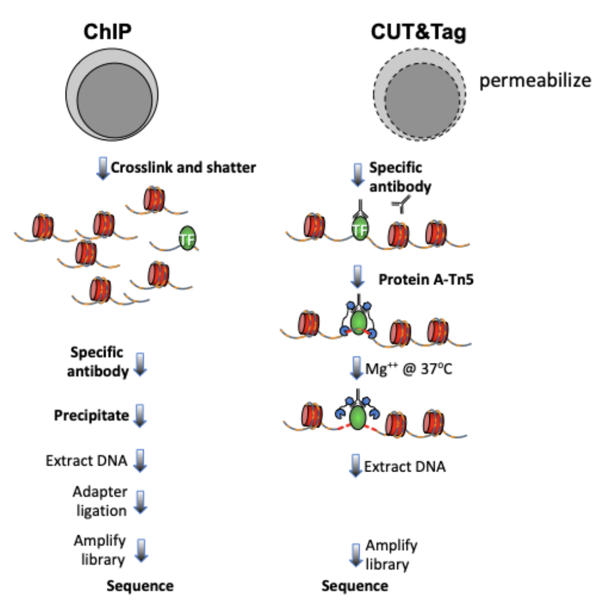
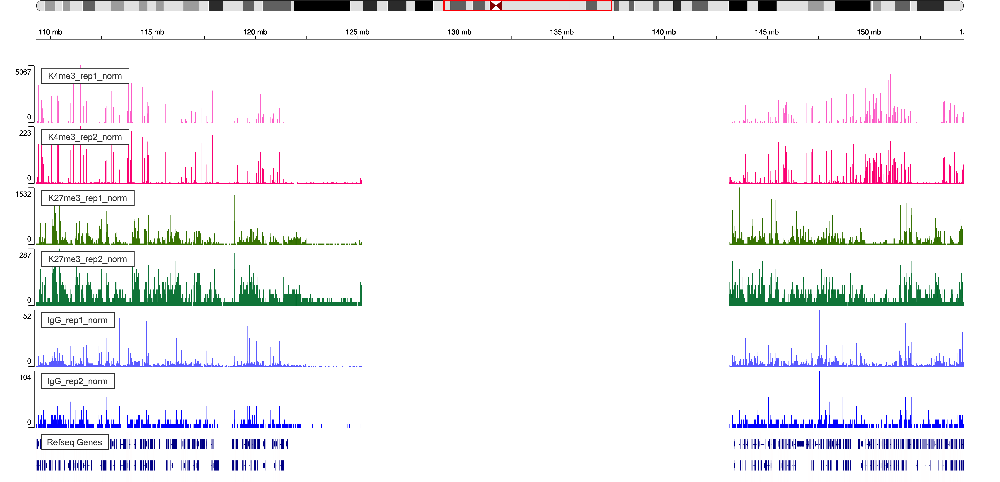

<!-- --- -->
<!-- title: "CUT&Tag Data Processing and Analysis Tutorial" -->
<!-- author: "Ye Zheng" -->
<!-- output: -->
<!--   html_document: -->
<!--     toc: true -->
<!--     toc_float: true -->
<!--     #number_sections: false -->
<!--     code_folding: show -->
<!-- editor_options: -->
<!--   chunk_output_type: console -->
<!-- --- -->

<!-- <style> -->
<!-- body{text-align: justify} -->
<!-- pre code, pre, code { -->
<!--   white-space: pre !important; -->
<!--   overflow-x: scroll !important; -->
<!--   word-break: keep-all !important; -->
<!--   word-wrap: initial !important; -->
<!-- } -->
<!-- </style> -->
*contact: yzheng23@fredhutch.org*

*File creation: March 13, 2020*  

*Final Update: June 7, 2020* 

**Approximate time: 60 - 120 minutes**

```{r setup, include=FALSE, dev="CairoPNG"}
knitr::opts_chunk$set(echo = TRUE, dev="CairoPNG", out.width = "100%")#, cache=TRUE)
```

```{r echo=FALSE, eval=TRUE, message=FALSE, warning=FALSE}
library(dplyr)
library(stringr)
library(ggplot2)
library(viridis)
library(GenomicRanges)
library(chromVAR) ## For FRiP analysis and differential analysis
library(DESeq2) ## For differential analysis section
```


# I. Introduction

## 1.1. Overview of CUT&Tag 
 
Cleavage Under Targets and Tagmentation (CUT&Tag) is an epigenomic profiling strategy in which antibodies are bound to chromatin proteins in situ in permeabilized nuclei, and then used to tether the cut-and-paste transposase Tn5. Activation of the transposase simultaneously cleaves DNA and adds DNA sequencing adapters (“tagmentation”) for paired-end DNA sequencing. The most recent streamlined CUT&Tag protocol has successfully suppressed exposure artifacts to ensure high-fidelity mapping of the antibody-targeted protein and improved signal-to-noise over current chromatin profiling methods. Streamlined CUT&Tag can be performed in a single PCR tube from cells to amplified libraries, providing low-cost high-resolution genome-wide chromatin maps. By simplifying library preparation, CUT&Tag requires less than a day at the bench from live cells to sequencing-ready barcoded libraries. Because of low background levels, barcoded and pooled CUT&Tag libraries can be sequenced for ~$25 per sample, enabling routine genome-wide profiling of chromatin proteins and modifications that requires no special skills or equipment.

The mapping of chromatin features genome-wide has traditionally been performed using chromatin immunoprecipitation (ChIP), in which chromatin is cross-linked and solubilized and an antibody to a protein or modification of interest is used to immunoprecipitate the bound DNA. Very little has changed in the way ChIP is most generally performed since it was first described 35 years ago, and remains fraught with signal-to-noise issues and artifacts. An alternative chromatin profiling strategy is enzyme tethering in situ whereby the chromatin protein or modification of interest is targeted by an antibody or fusion protein, and the underlying DNA is marked or released. A succession of enzyme-tethering methods have been introduced over the past two decades. Cleavage Under Targets & Tagmentation (CUT&Tag) is a tethering method that uses a protein-A-Tn5 (pA-Tn5) transposome fusion protein. Permeabilized cells or nuclei are incubated with antibody to a specified chromatin protein, and then pA-Tn5 loaded with mosaic end adaptors is successively tethered to antibody-bound sites. Activation of the transposome by adding magnesium ions results in the integration of the adaptors into nearby DNA. These are then amplified to generate sequencing libraries. Antibody-tethered Tn5-based methods achieve high sensitivity owing to stringent washing of samples after pA-Tn5 tethering and the high efficiency of adaptor integration. The improved signal-to-noise relative to ChIP-seq translates to an order-of-magnitude reduction in the amount of sequencing required to map chromatin features. Therefore, we use barcoded PCR primers to enable sample-pooling (typically up to 90 samples) for paired-end sequencing on Illumina NGS sequencers.
 
With all the differences between ChIP-seq and CUT&Tag data, we launched this tutorial tailored for processing and analyzing CUT&Tag data.



## 1.2. Objectives

This tutorial is designed for processing and analyzing CUT&Tag data following the [Bench top CUT&Tag V.3 protocol](https://www.protocols.io/view/bench-top-cut-amp-tag-bcuhiwt6/abstract), an enzyme-tethering strategy that provides efficient high-resolution sequencing libraries for profiling diverse chromatin components. Notably, the illustration data used in this tutorial is histone modification data but CUT&Tag is not limited to histone modification, but generally applicable, for example, to non-histone proteins complexes and transcription factors. The data processing and analysis in this tutorial is broadly applicable to protein epitopes and tags.

## 1.3. Requirements

- Linux system

- R (versions >= 3.6)
  - dplyr
  - stringr
  - ggplot2
  - viridis
  - GenomicRanges
  - chromVAR
  - DESeq2
  - ChIPseqSpikeInFree

- FastQC(version >= 0.11.9)

- Bowtie2 (version >= 2.3.4.3)

- samtools (version >= 1.10)

- bedtools (version >= 2.29.1)

- Picard (version >= 2.18.29)

- SEACR (version >= 1.3)

- deepTools (version >= 2.0)
 
## 1.4. Data downloading

In this tutorial, we use data from Kaya-Okur et al. (2020). The 

```{r, engine = 'bash', eval = FALSE}
##== linux command ==##
## specify the path to this tutorial/project
projPath="/path/to/project/where/data/and/results/are/saved"
```


- H3K27me3: 
  - GSE145187: SH_Hs_K27m3_NX_0918 as replicate 1
  - GSE145187: SH_Hs_K27m3_Xpc_0107 as replicate 2

- H3K4me3:
  - GSE145187: SH_Hs_K4m3_NX_0918 as replicate 1
  - GSE145187: SH_Hs_K4m3_Xpc_0107 as replicate 2

- IgG:
  - GSE145187: SH_Hs_IgG_o_2kA_0919 as replicate 1
  
  
  - GSM3680227 as replicate 2
```{r, engine = 'bash', eval = FALSE}
##== linux command ==##
wget -O $projPath/data/IgG_rep2/IgG_rep2_R1_001.fastq.gz ftp://ftp.sra.ebi.ac.uk/vol1/fastq/SRR875/001/SRR8754611/SRR8754611_1.fastq.gz

wget -O $projPath/data/IgG_rep2/IgG_rep2_R2_001.fastq.gz ftp://ftp.sra.ebi.ac.uk/vol1/fastq/SRR875/001/SRR8754611/SRR8754611_2.fastq.gz

wget -O $projPath/data/IgG_rep2/IgG_rep2_R1_002.fastq.gz ftp://ftp.sra.ebi.ac.uk/vol1/fastq/SRR875/002/SRR8754612/SRR8754612_1.fastq.gz

wget -O $projPath/data/IgG_rep2/IgG_rep2_R2_002.fastq.gz ftp://ftp.sra.ebi.ac.uk/vol1/fastq/SRR875/002/SRR8754612/SRR8754612_2.fastq.gz
```


# II. Data Pre-processing

## 2.1. Merge technical replicate if needed [Optional]

```{r, engine = 'bash', eval = FALSE}
##== linux command ==##
histName="K27me3"
mkdir -p ${projPath}/fastq
cat ${projPath}/data/${histName}/*_R1_*.fastq.gz >${projPath}/fastq/${histName}_R1.fastq.gz
cat ${projPath}/data/${histName}/*_R2_*.fastq.gz >${projPath}/fastq/${histName}_R2.fastq.gz
```


# III. Alignment

 
## 3.1. Bowtie2 alignment [required]
 
```{r, engine = 'bash', eval = FALSE}
##== linux command ==##
cores=8
ref="/path/to/bowtie2Index/hg38"

mkdir -p ${projPath}/alignment/sam/bowtie2_summary
mkdir -p ${projPath}/alignment/bam
mkdir -p ${projPath}/alignment/bed
mkdir -p ${projPath}/alignment/bedgraph

## Build the bowtie2 reference genome index if needed:
## bowtie2-build path/to/hg38/fasta/hg38.fa /path/to/bowtie2Index/hg38

bowtie2 --end-to-end --very-sensitive --no-mixed --no-discordant --phred33 -I 10 -X 700 -p ${cores} -x ${ref} -1 ${projPath}/fastq/${histName}_R1.fastq.gz -2 ${projPath}/fastq/${histName}_R2.fastq.gz -S ${projPath}/alignment/sam/${histName}_bowtie2.sam &> ${projPath}/alignment/sam/bowtie2_summary/${histName}_bowtie2.txt
```

The paired-end reads are aligned by Bowtie2 using parameters: ```--end-to-end --very-sensitive --no-mixed --no-discordant --phred33 -I 10 -X 700```

Parameters explanation:

http://bowtie-bio.sourceforge.net/bowtie2/manual.shtml

Bowtie2 alignment results summary is saved at ```${projPath}/alignment/sam/bowtie2)summary/${histName}_bowtie2.txt```:

```
2984630 reads; of these:
  2984630 (100.00%) were paired; of these:
    125110 (4.19%) aligned concordantly 0 times
    2360430 (79.09%) aligned concordantly exactly 1 time
    499090 (16.72%) aligned concordantly >1 times
95.81% overall alignment rate
```

- 2984640 is the sequencing depth, i.e., total number of paired reads.
- 125110 is the number of read pairs that fail to be mapped.
- 2360430 + 499090 is the number of read paris that are successfully mapped.
- 95.81% is the overall alignment rate

### 3.1.1 Sequencing depth

We first check the sequencing depth of the data we have before alignment. 

```{r echo=TRUE, eval = TRUE, message=FALSE, warning=FALSE, fig.width=10, fig.height=8, out.width = "100%"}
##=== R command ===## 
## Path to the project and histone list
projPath = "/fh/fast/gottardo_r/yezheng_working/cuttag/CUTTag_tutorial"
histList = c("K27me3_rep1", "K27me3_rep2", "K4me3_rep1", "K4me3_rep2", "IgG_rep1", "IgG_rep2")

## Collect the alignment results from the bowtie2 alignment summary files
alignResult = c()
for(hist in histList){
  alignRes = read.table(paste0(projPath, "/alignment/sam/bowtie2_summary/", hist, "_bowtie2.txt"), header = FALSE, fill = TRUE)
  alignRate = substr(alignRes$V1[6], 1, nchar(as.character(alignRes$V1[6]))-1)
  histInfo = strsplit(hist, "_")[[1]]
  alignResult = data.frame(seqDepth = alignRes$V1[1] %>% as.character %>% as.numeric, alignNum = alignRes$V1[4] %>% as.character %>% as.numeric + alignRes$V1[5] %>% as.character %>% as.numeric, alignRate = alignRate %>% as.numeric, Histone = histInfo[1], Replicate = histInfo[2])  %>% rbind(alignResult, .)
}

## Generate sequencing depth boxplot
alignResult %>% ggplot(aes(x = Histone, y = seqDepth, fill = Histone)) +
    geom_boxplot() +
    geom_jitter(aes(color = Replicate), position = position_jitter(0.15)) +
    scale_fill_viridis(discrete = TRUE, begin = 0.1, end = 0.9, option = "magma", alpha = 0.8) +
    scale_color_viridis(discrete = TRUE, begin = 0.1, end = 0.9) +
    theme_bw(base_size = 20) +
    ylab("Sequencing Depth") +
    xlab("")

```
 
- Millions of reads are collected for the illustration data. 

- A clean histone modifification antibody will give you robust results (based on FRiP analysis covered in later section) with only 1 million fragments, but a low-affinity antibody to a transcription factor will require 10 times as many fragments to call peaks. In [Protocols.io - Bench Top CUT&Tag V.3](https://www.protocols.io/view/bench-top-cut-amp-tag-bcuhiwt6?step=69) we show an example of tracks from a typical experiment with ~2-3 million fragments.

### 3.1.2 Alignment rate

One aspect to check the quality of the data is to look at the alignment rate.
```{r echo=TRUE, eval = TRUE, message=FALSE, warning=FALSE, fig.width=10, fig.height=8}
##=== R command ===## 
alignResult %>% ggplot(aes(x = Histone, y = alignRate, fill = Histone)) +
    geom_boxplot() +
    geom_jitter(aes(color = Replicate), position = position_jitter(0.15)) +
    scale_fill_viridis(discrete = TRUE, begin = 0.1, end = 0.9, option = "magma", alpha = 0.8) +
    scale_color_viridis(discrete = TRUE, begin = 0.1, end = 0.9) +
    theme_bw(base_size = 20) +
    ylab("% of Mapped Fragments") +
    xlab("")
```

- The alignment rates are all above 80% which is pretty high.

### 3.1.3 Number of alignable reads

After alignment, we can check the number of mapped reads, i.e., valid sequencing depth for downstream analysis.
```{r echo=TRUE, eval = TRUE, message=FALSE, warning=FALSE, fig.width=10, fig.height=8}
##=== R command ===## 
alignResult %>% ggplot(aes(x = Histone, y = alignNum, fill = Histone)) +
    geom_boxplot() +
    geom_jitter(aes(color = Replicate), position = position_jitter(0.15)) +
    scale_fill_viridis(discrete = TRUE, begin = 0.1, end = 0.9, option = "magma", alpha = 0.8) +
    scale_color_viridis(discrete = TRUE, begin = 0.1, end = 0.9) +
    theme_bw(base_size = 20) +
    ylab("# of Mapped Fragments") +
    xlab("")
```

- There are still millions of reads that are alignable and pass on to downstream analysis.

## 3.2. Filtering mapped reads by the mapping quality filtering [optional]

Some project may require more stringent filtering on the alignment quality score. This [blog](http://biofinysics.blogspot.com/2014/05/how-does-bowtie2-assign-mapq-scores.html) detailedly discussed how does bowtie assign quality score with examples.

MAPQ(x) = -10 * $log_{10}$(P(x is mapped wrongly)) = -10 * $log_{10}(p)$

which ranges from 0 to 37, 40 or 42.

```samtools view -q minQualityScore``` will eliminate all the alignment results that are below the minQualityScore defined by user.
```{r, engine = 'bash', eval = FALSE}
##== linux command ==##
minQualityScore=2
samtools view -q $minQualityScore ${projPath}/alignment/sam/${histName}_bowtie2.sam >${projPath}/alignment/sam/${histName}_bowtie2.qualityScore$minQualityScore.sam
```

- If you do implement this filtering, please replace the following input sam file into this filtered sam file.

## 3.3. Remove duplicates [optional/required] 

- CUT&Tag uses the antibody-tethered Tn5-based methods that can achieve high sensitivity, hence the resulting background noise is low and signal regions are enriched and narrow. Therefore, theoretically we may collect fragments that share exactly the same starting and ending sequences which are not because of the PCR duplication.

- Practically, we found for high quality and high sequencing depth samples, the duplication rate is pretty low and the rest duplicated fragments are highly likely to be the true enrichment signals. Thus, for these sample, we do not recommend removing the duplicates. 

- However, for samples that are of low quality and have too few sequencing depth, their duplication rate can be super high. We recommend removing the duplicates for these samples.

- The following commands show how to check the duplication rate using ```Picard```.

```{r, engine = 'bash', eval = FALSE}
##== linux command ==##
## depending on how you load picard and your server environment, the picardCMD can be different. Adjust accordingly.
picardCMD="java -jar picard.jar"
mkdir -p $projPath/alignment/rmDuplicate/picard_summary

## Sort by coordinate
$picardCMD SortSam I=$projPath/alignment/sam/${histName}_bowtie2.sam O=$projPath/alignment/sam/${histName}_bowtie2.sorted.sam SORT_ORDER=coordinate

## mark duplicates
$picardCMD MarkDuplicates I=$projPath/alignment/sam/${histName}_bowtie2.sorted.sam O=$projPath/alignment/removeDuplicate/${histName}_bowtie2.sorted.dupMarked.sam METRICS_FILE=$projPath/alignment/removeDuplicate/picard_summary/${histName}_picard.dupMark.txt

## remove duplicates
picardCMD MarkDuplicates I=$projPath/alignment/sam/${histName}_bowtie2.sorted.sam O=$projPath/alignment/removeDuplicate/${histName}_bowtie2.sorted.rmDup.sam REMOVE_DUPLICATES=true METRICS_FILE=$projPath/alignment/removeDuplicate/picard_summary/${histName}_picard.rmDup.txt
```

### 3.3.1 Duplication rate

First, we summarize the duplication rate. 

```{r echo=TRUE, eval = TRUE, message=FALSE, warning=FALSE, fig.width=10, fig.height=8}
##=== R command ===## 
## Summarize the duplication information from the picard summary outputs.
dupResult = c()
for(hist in histList){
  dupRes = read.table(paste0(projPath, "/alignment/rmDuplicate/picard_summary/", hist, "_picard.rmDup.txt"), header = TRUE, fill = TRUE)
  
  histInfo = strsplit(hist, "_")[[1]]
  dupResult = data.frame(mappedN = dupRes$READ_PAIRS_EXAMINED[1] %>% as.character %>% as.numeric, dupRate = dupRes$PERCENT_DUPLICATION[1] %>% as.character %>% as.numeric, Histone = histInfo[1], Replicate = histInfo[2]) %>% mutate(uniqN = mappedN * (1-dupRate))  %>% rbind(dupResult, .)
}

## generate boxplot figure for the  duplication rate
dupResult %>% ggplot(aes(x = Histone, y = dupRate * 100, fill = Histone)) +
    geom_boxplot() +
    geom_jitter(aes(color = Replicate), position = position_jitter(0.15)) +
    scale_fill_viridis(discrete = TRUE, begin = 0.1, end = 0.9, option = "magma", alpha = 0.8) +
    scale_color_viridis(discrete = TRUE, begin = 0.1, end = 0.9) +
    theme_bw(base_size = 20) +
    ylab("Duplication Rate (*100%)") +
    xlab("")

```

- IgG samples in this tutorial have relatively high duplication rate. Therefore, it is recommended to remove the duplicates for IgG samples before downstream anlysis.


### 3.3.2 Unique library size

Next, we check the unique library size without duplications.

```{r echo=TRUE, eval = TRUE, message=FALSE, warning=FALSE, fig.width=10, fig.height=8}
##=== R command ===## 
dupResult %>% ggplot(aes(x = Histone, y = uniqN, fill = Histone)) +
    geom_boxplot() +
    geom_jitter(aes(color = Replicate), position = position_jitter(0.15)) +
    scale_fill_viridis(discrete = TRUE, begin = 0.1, end = 0.9, option = "magma", alpha = 0.8) +
    scale_color_viridis(discrete = TRUE, begin = 0.1, end = 0.9) +
    theme_bw(base_size = 20) +
    ylab("# of Unique Fragments") +
    xlab("")
```

- We still have millions of unique fragments left.

## 3.4. Assess mapped fragment size distribution [Required]
```{r, engine = 'bash', eval = FALSE}
##== linux command ==##
mkdir -p $projPath/alignment/sam/fragmentLen

## Extract the 9th column from the alignment sam file which is the fragment length
samtools view -F 0x04 $projPath/alignment/sam/${histName}_bowtie2.sam | awk -F'\t' 'function abs(x){return ((x < 0.0) ? -x : x)} {print abs($9)}' | sort | uniq -c | awk -v OFS="\t" '{print $2, $1/2}' >$projPath/alignment/sam/fragmentLen/${histName}_fragmentLen.txt
```

```{r echo=TRUE, eval = TRUE, message=FALSE, warning=FALSE, fig.width=10, fig.height=8}
##=== R command ===## 
## Collect the fragment size information
fragLen = c()
for(hist in histList){
  histInfo = strsplit(hist, "_")[[1]]
  fragLen = read.table(paste0(projPath, "/alignment/sam/fragmentLen/", hist, "_fragmentLen.txt"), header = FALSE) %>% mutate(fragLen = V1 %>% as.numeric, fragCount = V2 %>% as.numeric, Weight = as.numeric(V2)/sum(as.numeric(V2)), Histone = histInfo[1], Replicate = histInfo[2], histInfo = hist) %>% rbind(fragLen, .)
  
}

## Generate the fragment size density plot (violin plot)
fragLen %>% ggplot(aes(x = factor(histInfo, histList), y = fragLen, weight = Weight, fill = Histone)) +
    geom_violin(bw = 5) +
    scale_y_continuous(breaks = seq(0, 800, 50)) +
    scale_fill_viridis(discrete = TRUE, begin = 0.1, end = 0.9, option = "magma", alpha = 0.8) +
    scale_color_viridis(discrete = TRUE, begin = 0.1, end = 0.9) +
    theme_bw(base_size = 20) +
    ggpubr::rotate_x_text(angle = 20) +
    ylab("Fragment Length") +
    xlab("")
```

- There should be periodic peaking pattern of 200bp as a unit for the histone modification target.
- These are fragments that are the size of nucleosomes, the expected result of targeting histone.
- The smaller fragments (50-100 bp) can be due to that tethered Tn5 can tagment on the surface of a nucleosome as well as in linker regions, so the small fragments might not be background.

Zooming into the single base pair, the fragment counts distribution at each fragment length reveals the 10-bp periodicity, which is a unique feature of tagmentation and can provide as a confirmation that the experiment worked. 
```{r echo=TRUE, eval = TRUE, message=FALSE, warning=FALSE, fig.width=10, fig.height=8}
##=== R command ===## 

fragLen %>% ggplot(aes(x = fragLen, y = fragCount, color = Histone, group =interaction(Histone, Replicate), linetype = Replicate)) +
    ## geom_point(size = 0.8, shape = 19) +
    geom_line(size = 1) +
    ## scale_y_continuous(breaks = seq(0, 800, 50)) +
    scale_color_viridis(discrete = TRUE, begin = 0.1, end = 0.9, option = "magma") +
    theme_bw(base_size = 20) +
    ## ggpubr::rotate_x_text(angle = 20) +
    xlab("Fragment Length") +
    ylab("Count") +
  coord_cartesian(xlim = c(0, 500))
```


# IV. Alignment results filtering and file format conversion

This section is **required** in preparation for the peak calling and visualization where there are a few filtering and file format conversion that need to be done.

```{r, engine = 'bash', eval = FALSE}
##== linux command ==##
## Filter and keep the mapped read pairs
samtools view -bS -F 0x04 $projPath/alignment/sam/${histName}_bowtie2.sam $projPath/alignment/bam/${histName}_bowtie2.mapped.bam

## Convert into bed file format
bedtools bamtobed -i $projPath/alignment/bam/${histName}_bowtie2.mapped.bam -bedpe $projPath/alignment/bed/${histName}_bowtie2.bed

## Keep the read pairs that are on the same chromosome and fragment length less than 1000bp.
awk '$1==$4 && $6-$2 < 1000 {print $0}' $projPath/alignment/bed/${histName}_bowtie2.bed $projPath/alignment/bed/${histName}_bowtie2.clean.bed

## Only extract the fragment related columns
cut -f 1,2,6 $projPath/alignment/bed/${histName}_bowtie2.clean.bed | sort -k1,1 -k2,2n -k3,3n  >$projPath/alignment/bed/${histName}_bowtie2.fragments.bed
```

# V. Spike-in calibration 

This section is **optional** but **recommended** depending on your experimental protocol.

## 5.1 Alignment to the spike-in genome [optional/recommended]

- To calibrate samples in a series for samples done in parallel using the same antibody we use counts of E. coli fragments carried over with the pA-Tn5 the same as one would for an ordinary spike-in. 

- We align E. coli carry-over fragments to the NCBI Ecoli genome (Escherichia coli str. K12 substr. MG1655 U00096.3) with ```--no-overlap --no-dovetail``` options (```--end-to-end --very-sensitive --no-overlap --no-dovetail --no-mixed --no-discordant  --phred33 -I 10 -X 700````) to avoid possible cross-mapping of the experimental genome to that of the carry-over E. coli DNA that is used for calibration.

```{r, engine = 'bash', eval = FALSE}
##== linux command ==##
spikeInRef="/shared/ngs/illumina/henikoff/Bowtie2/Ecoli"
chromSize="/fh/fast/gottardo_r/yezheng_working/SupplementaryData/hg38/chromSize/hg38.chrom.size"

## bowtie2-build path/to/Ecoli/fasta/Ecoli.fa /path/to/bowtie2Index/Ecoli
bowtie2 --end-to-end --very-sensitive --no-mixed --no-discordant --phred33 -I 10 -X 700 -p ${cores} -x ${spikeInRef} -1 ${projPath}/fastq/${histName}_R1.fastq.gz -2 ${projPath}/fastq/${histName}_R2.fastq.gz -S $projPath/alignment/sam/${histName}_bowtie2_spikeIn.sam &> $projPath/alignment/sam/bowtie2_summary/${histName}_bowtie2_spikeIn.txt

seqDepthDouble=`samtools view -F 0x04 seqDepth=$((seqDepthDouble/2))
echo $seqDepth >$projPath/alignment/sam/bowtie2_summary/${histName}_bowtie2_spikeIn.seqDepth


if [[ "$seqDepth" -gt "1" ]]; then
    
    mkdir -p $projPath/alignment/bedgraph

    scale_factor=`echo "10000 / $seqDepth" | bc -l`
    echo "Scaling factor for $histName is: $scale_factor!"
    bedtools genomecov -bg -scale $scale_factor -i $projPath/alignment/bed/${histName}_bowtie2.fragments.bed -g $chromSize > $projPath/alignment/bedgraph/${histName}_bowtie2.fragments.normalized.bedgraph
    
fi
```

## 5.2 Spike-in alignment rate
```{r echo=TRUE, eval = TRUE, message=FALSE, warning=FALSE, fig.width=10, fig.height=8}
##=== R command ===## 
spikeAlign = c()
for(hist in histList){
  spikeRes = read.table(paste0(projPath, "/alignment/sam/bowtie2_summary/", hist, "_bowtie2_spikeIn.txt"), header = FALSE, fill = TRUE)
  alignRate = substr(spikeRes$V1[6], 1, nchar(as.character(spikeRes$V1[6]))-1)
  histInfo = strsplit(hist, "_")[[1]]
  spikeAlign = data.frame(seqDepth = spikeRes$V1[1] %>% as.character %>% as.numeric, alignNum = spikeRes$V1[4] %>% as.character %>% as.numeric + spikeRes$V1[5] %>% as.character %>% as.numeric, alignRate = alignRate %>% as.numeric, Histone = histInfo[1], Replicate = histInfo[2])  %>% rbind(spikeAlign, .)
}

## Generate alignment rate boxplot
spikeAlign %>% ggplot(aes(x = Histone, y = alignRate, fill = Histone)) +
    geom_boxplot() +
    geom_jitter(aes(color = Replicate), position = position_jitter(0.15)) +
    scale_fill_viridis(discrete = TRUE, begin = 0.1, end = 0.9, option = "magma", alpha = 0.8) +
    scale_color_viridis(discrete = TRUE, begin = 0.1, end = 0.9) +
    theme_bw(base_size = 20) +
    ylab("Spike-in Alignment Rate") +
    xlab("")
```

- The percentage of reads mapped to E.coli depends on the number of cells and how broadly distributed the antibody epitope is. Based on our normal exploratory experiments, usually, this percentage range from 0.01% to 11.5%. 
- Especially for IgG, this percentage is usually much higher (2%-11.5%) than the histone modification. 
- For even wilder exploratory experiments, we found using a few thousand or even a few hundreds of cells, and this number can soar to 30% or even 70%. However, the percentage drops back to 4% using 65k cells. 

## 5.3 Scaling factor

The scaling factor is defined to be 

Scaling_factor = Scale multiplier/ (Total # of fragments mapped to spike-in genome)

```{r echo=TRUE, eval = TRUE, message=FALSE, warning=FALSE, fig.width=10, fig.height=8}
##=== R command ===## 
scaleFactor = c()
multiplier = 10000
for(hist in histList){
  spikeDepth = read.table(paste0(projPath, "/alignment/sam/bowtie2_summary/", hist, "_bowtie2_spikeIn.seqDepth"), header = FALSE, fill = TRUE)$V1[1]
  
  histInfo = strsplit(hist, "_")[[1]]
  scaleFactor = data.frame(scaleFactor = multiplier/spikeDepth, Histone = histInfo[1], Replicate = histInfo[2])  %>% rbind(scaleFactor, .)
}

## Generate sequencing depth boxplot
scaleFactor %>% ggplot(aes(x = Histone, y = scaleFactor, fill = Histone)) +
    geom_boxplot() +
    geom_jitter(aes(color = Replicate), position = position_jitter(0.15)) +
    scale_fill_viridis(discrete = TRUE, begin = 0.1, end = 0.9, option = "magma", alpha = 0.8) +
    scale_color_viridis(discrete = TRUE, begin = 0.1, end = 0.9) +
    theme_bw(base_size = 20) +
    ylab("Spike-in Scalling Factor") +
    xlab("")

```


- There is actually no universal scale factor that can be used on different samples. Instead, the key idea of calibration is 

    (primary_genome_mapped_count_at_bp) * Scaling_factor = 

    (primary_genome_mapped_count_at_bp) * Scale multiplier / (spike-in_genome_total_of_mapped_fragments)

- The underlying assumption is that the primary # genome to spike-in genome ratio per cell is expected to be the same for all samples that use the same number of cells in an experiment comparing treatment. 

- The "scale multiplier" in the above formula can be an arbitrary multiplier (e.g., 10000) to avoid small fractions. 

- The drop of file size should be expected as the input files are the alignment for all the fragments but the output is genome coverage which is like a summary of the fragment alignment results. However, it won't hurt to carefully check the output file.


## 5.4 Total number of fragments after normalization (seqDepth)

```{r echo=TRUE, eval = TRUE, message=FALSE, warning=FALSE, fig.width=10, fig.height=8}
##=== R command ===## 
normDepth = inner_join(scaleFactor, alignResult, by = c("Histone", "Replicate")) %>% mutate(normDepth = alignNum * scaleFactor)

normDepth %>% ggplot(aes(x = Histone, y = normDepth, fill = Histone)) +
    geom_boxplot() +
    geom_jitter(aes(color = Replicate), position = position_jitter(0.15)) +
    scale_fill_viridis(discrete = TRUE, begin = 0.1, end = 0.9, option = "magma", alpha = 0.8) +
    scale_color_viridis(discrete = TRUE, begin = 0.1, end = 0.9) +
    theme_bw(base_size = 20) +
    ylab("Total number of fragments after normalization") +
    xlab("") + 
    coord_cartesian(ylim = c(1000000, 130000000))

```

## 5.5 ChIPseqSpikeInFree for experiments without spike-ins [Optional]

[ChIPseqSpikeInFree: a ChIP-seq normalization approach to reveal global changes in histone modifications without spike-in](https://academic.oup.com/bioinformatics/article/36/4/1270/5578481) is a novel ChIP-seq normalization method to effectively determine scaling factors for samples across various conditions and treatments, which does not rely on exogenous spike-in chromatin or peak detection to reveal global changes in histone modification occupancy. The installation details can be found on [github](https://github.com/stjude/ChIPseqSpikeInFree).


# VI. Peak calling

## 6.1. SEACR

The usage manual of SEACR can be found [here](https://github.com/FredHutch/SEACR/). We have calibrated the fragment frequency with respect to the spike-in, therefore for field 3, we can set the normalization option to be "non". Otherwise, "norm" is recommended.

```{r, engine = 'bash', eval = FALSE}
##== linux command ==##
seacr="/fh/fast/gottardo_r/yezheng_working/Software/SEACR/SEACR_1.3.sh"
histControl=$2
mkdir -p $projPath/peakCalling/SEACR

bash $seacr $projPath/alignment/bedgraph/${histName}_bowtie2.fragments.normalized.bedgraph \
     $projPath/alignment/bedgraph/${histControl}_bowtie2.fragments.normalized.bedgraph \
     non stringent $projPath/peakCalling/SEACR/${histName}_seacr_control.peaks

bash $seacr $projPath/alignment/bedgraph/${histName}_bowtie2.fragments.normalized.bedgraph 0.01 non stringent $projPath/peakCalling/SEACR/${histName}_seacr_top0.01.peaks
```

### 6.1.1 Number of peaks called

```{r echo=TRUE, eval = TRUE, message=FALSE, warning=FALSE, fig.width=10, fig.height=8}
##=== R command ===## 
peakN = c()
peakWidth = c()
peakType = c("control", "top0.01")
for(hist in histList){
  histInfo = strsplit(hist, "_")[[1]]
  if(histInfo[1] != "IgG"){
    for(type in peakType){
      peakInfo = read.table(paste0(projPath, "/peakCalling/SEACR/", hist, "_seacr_", type, ".peaks.stringent.bed"), header = FALSE, fill = TRUE)  %>% mutate(width = abs(V3-V2))
      peakN = data.frame(peakN = nrow(peakInfo), peakType = type, Histone = histInfo[1], Replicate = histInfo[2]) %>% rbind(peakN, .)
      peakWidth = data.frame(width = peakInfo$width, peakType = type, Histone = histInfo[1], Replicate = histInfo[2])  %>% rbind(peakWidth, .)
    }
  }
}

peakN %>% ggplot(aes(x = Histone, y = peakN, fill = Histone)) +
    geom_boxplot() +
    geom_jitter(aes(color = Replicate), position = position_jitter(0.15)) +
    facet_grid(~peakType) +
    scale_fill_viridis(discrete = TRUE, begin = 0.1, end = 0.9, option = "magma", alpha = 0.8) +
    scale_color_viridis(discrete = TRUE, begin = 0.1, end = 0.9) +
    theme_bw(base_size = 20) +
    ylab("Number of Peaks") +
    xlab("")
```

### 6.1.2 Distribution of the peak width

```{r echo=TRUE, eval = TRUE, message=FALSE, warning=FALSE, fig.width=10, fig.height=8}
##=== R command ===## 
peakWidth %>% ggplot(aes(x = Histone, y = width, fill = Histone)) +
    geom_violin() +
    facet_grid(Replicate~peakType) +
    scale_fill_viridis(discrete = TRUE, begin = 0.1, end = 0.9, option = "magma", alpha = 0.8) +
    scale_color_viridis(discrete = TRUE, begin = 0.1, end = 0.9) +
    theme_bw(base_size = 20) +
    ylab("Width of Peaks") +
    xlab("")
```

```{r echo=TRUE, eval = TRUE, message=FALSE, warning=FALSE, fig.width=10, fig.height=8}
##=== R command ===## 
peakWidth %>% ggplot(aes(x = Histone, y = width, fill = Histone)) +
    geom_violin() +
    facet_grid(Replicate~peakType) +
    scale_fill_viridis(discrete = TRUE, begin = 0.1, end = 0.9, option = "magma", alpha = 0.8) +
    scale_color_viridis(discrete = TRUE, begin = 0.1, end = 0.9) +
    theme_bw(base_size = 20) +
    ylab("Width of Peaks") +
    xlab("") +
    coord_cartesian(ylim = c(0, 25000))
```

### 6.1.3 Reproducibility of the peak across biological replicates

```{r echo=TRUE, eval = TRUE, message=FALSE, warning=FALSE, fig.width=10, fig.height=8}
##=== R command ===## 
histL = c("K27me3", "K4me3")
repL = paste0("rep", 1:2)
peakType = c("control", "top0.01")
peakOverlap = c()
for(type in peakType){
  for(hist in histL){
    overlap.gr = GRanges()
    for(rep in repL){
      peakInfo = read.table(paste0(projPath, "/peakCalling/SEACR/", hist, "_", rep, "_seacr_", type, ".peaks.stringent.bed"), header = FALSE, fill = TRUE)
      peakInfo.gr = GRanges(peakInfo$V1, IRanges(start = peakInfo$V2, end = peakInfo$V3), strand = "*")
      if(length(overlap.gr) >0){
        overlap.gr = overlap.gr[findOverlaps(overlap.gr, peakInfo.gr)@from]
      }else{
        overlap.gr = peakInfo.gr
        
      }
    }
    peakOverlap = data.frame(peakReprod = length(overlap.gr), Histone = hist, peakType = type) %>% rbind(peakOverlap, .)
  }
}

peakReprod = left_join(peakN, peakOverlap, by = c("Histone", "peakType")) %>% mutate(peakReprodRate = peakReprod/peakN * 100)

peakReprod %>% ggplot(aes(x = Histone, y = peakReprodRate, fill = Histone, label = round(peakReprodRate, 2))) +
    geom_bar(stat = "identity") +
    geom_text(vjust = 0.1) +
    facet_grid(Replicate~peakType) +
    scale_fill_viridis(discrete = TRUE, begin = 0.1, end = 0.9, option = "magma", alpha = 0.8) +
    scale_color_viridis(discrete = TRUE, begin = 0.1, end = 0.9) +
    theme_bw(base_size = 20) +
    ylab("% of Peaks Reproduced across Biological Replicate") +
    xlab("")
```

### 6.1.4 Fraction of Reads in Peaks regions (FRiPs).

- We utilize the SEACR peaks contrasting with IgG controls for illustration.

```{r echo=TRUE, eval = TRUE, message=FALSE, warning=FALSE, fig.width=10, fig.height=8}
##=== R command ===## 
library(chromVAR)

bamDir = paste0(projPath, "/alignment/bam")
inPeakData = c()
## overlap with bam file to get count
for(hist in histL){
  for(rep in repL){
    peakRes = read.table(paste0(projPath, "/peakCalling/SEACR/", hist, "_", rep, "_seacr_control.peaks.stringent.bed"), header = FALSE, fill = TRUE)
    peak.gr = GRanges(seqnames = peakRes$V1, IRanges(start = peakRes$V2, end = peakRes$V3), strand = "*")
    bamFile = paste0(bamDir, "/", hist, "_", rep, "_bowtie2.mapped.bam")
    fragment_counts <- getCounts(bamFile, peak.gr, paired = TRUE, by_rg = FALSE, format = "bam")
    inPeakN = counts(fragment_counts)[,1] %>% sum
    inPeakData = rbind(inPeakData, data.frame(inPeakN = inPeakN, Histone = hist, Replicate = rep))
  }
}

frip = left_join(inPeakData, alignResult, by = c("Histone", "Replicate")) %>% mutate(frip = inPeakN/alignNum)


frip %>% ggplot(aes(x = Histone, y = frip, fill = Histone, label = round(frip, 2))) +
    geom_boxplot() +
    geom_jitter(aes(color = Replicate), position = position_jitter(0.15)) +
    scale_fill_viridis(discrete = TRUE, begin = 0.1, end = 0.9, option = "magma", alpha = 0.8) +
    scale_color_viridis(discrete = TRUE, begin = 0.1, end = 0.9) +
    theme_bw(base_size = 20) +
    ylab("Fraction of Reads in Peaks") +
    xlab("")

```


## 6.2. Other peak calling methods.

### 6.2.1 MACS2: [Model-based Analysis of ChIP-Seq (MACS)](https://genomebiology.biomedcentral.com/articles/10.1186/gb-2008-9-9-r137). Installation details can be found [here](https://github.com/taoliu/MACS/wiki).
 
```{r, engine = 'bash', eval = FALSE}
##== linux command ==##
histName="K27me3"
controlName="IgG"

mkdir -p $projPath/peakCalling
macs2 callpeak -t ${projPath}/alignment/bam/${histName}_rep1_bowtie2.mapped.bam \
      -c ${projPath}/alignment/bam/${controlName}_rep1_bowtie2.mapped.bam \
      -g hs -f BAMPE -n macs2_peak_q0.1 --outdir $projPath/peakCalling/MACS2 -q 0.1 --keep-dup all 2>${projPath}/peakCalling/MACS2/macs2Peak_summary.txt
```
 
### 6.2.2 Other peak calling methods that are widely used for ChIP-seq data may also be utilized.

- dPeak: [dPeak: High Resolution Identification of Transcription Factor Binding Sites from PET and SET ChIP-Seq Data](https://journals.plos.org/ploscompbiol/article?id=10.1371/journal.pcbi.1003246)

- MOSAiCS: [A Statistical Framework for the Analysis of ChIP-Seq Data](https://www.ncbi.nlm.nih.gov/pmc/articles/PMC4608541/)


# VII. Visualization

- [Integrative Genomic Viewer](http://software.broadinstitute.org/software/igv/home) provides web app version and local desktop version. Easy to use.

- [UCSC Genome Browser](https://genome.ucsc.edu/) provides the most comprehensive supplementary genome information.

## 7.1. Browser display of bedgraph files after spike-in calibration. 


- Check pericentromeric regions that contain lots of repeats are a good place to look since signal will naturally be enriched there for all antibody and IgG data.



## 7.2. Heatmap visualization on specific regions

We will use the ```computeMatrix``` and ```plotHeatmap``` functions from [deepTools](https://deeptools.readthedocs.io/en/develop/) to generate the heatmap.

```{r, engine = 'bash', eval = FALSE}
##== linux command ==##
mkdir -p $projPath/alignment/bigwig                                                                                                                                        
samtools sort -o $projPath/alignment/bam/${histName}.sorted.bam $projPath/alignment/bam/${histName}_bowtie2.mapped.bam                                                     
samtools index $projPath/alignment/bam/${histName}.sorted.bam                                                                                                              
bamCoverage -b $projPath/alignment/bam/${histName}.sorted.bam -o $projPath/alignment/bigwig/${histName}_raw.bw                                                             

```

### 7.2.1 Heatmap over transcription units


```{r, engine = 'bash', eval = FALSE}
##== linux command ==##
cores=8
computeMatrix scale-regions -S $projPath/alignment/bigwig/K27me3_rep1_raw.bw \
                               $projPath/alignment/bigwig/K27me3_rep2_raw.bw \
                               $projPath/alignment/bigwig/K4me3_rep1_raw.bw \
                               $projPath/alignment/bigwig/K4me3_rep2_raw.bw \
                              -R $projPath/data/hg38_gene/hg38_gene.tsv \
                              --beforeRegionStartLength 3000 \
                              --regionBodyLength 5000 \
                              --afterRegionStartLength 3000 \
                              --skipZeros -o $projPath/data/hg38_gene/matrix_gene.mat.gz -p $cores

plotHeatmap -m $projPath/data/hg38_gene/matrix_gene.mat.gz -out $projPath/data/hg38_gene/Histone_gene.png --sortUsing sum

```


### 7.2.2. Heatmap on CUT&Tag peaks

We use the center of the max signal region returned from SEACR. In the sixth column of the SEACR output, there is an entry in the form chr:start-end that represents the first and last bases in the region that attain the maximum signal in the region. We first generate a new bed file containing this peak summit information in column 6 and use deeptools for the heatmap visualization.

```{r, engine = 'bash', eval = FALSE}
##== linux command ==##
awk '{split($6, summit, ":"); split(summit[2], region, "-"); print summit[1]"\t"region[1]"\t"region[2]}' $projPath/peakCalling/SEACR/${histName}_${repName}_seacr_control.pe\
aks.stringent.bed >$projPath/peakCalling/SEACR/${histName}_${repName}_seacr_control.peaks.summitRegion.bed

computeMatrix reference-point -S $projPath/alignment/bigwig/${histName}_${repName}_raw.bw \
              -R $projPath/peakCalling/SEACR/${histName}_${repName}_seacr_control.peaks.summitRegion.bed \
              --skipZeros -o $projPath/peakCalling/SEACR/${histName}_${repName}_SEACR.mat.gz -p $cores -a 3000 -b 3000 --referencePoint center

plotHeatmap -m $projPath/peakCalling/SEACR/${histName}_SEACR.mat.gz -out $projPath/peakCalling/SEACR/${histName}_SEACR_heatmap.png --sortUsing sum --startLabel "Peak Start" -\
-endLabel "Peak End" --xAxisLabel "" --regionsLabel "Peaks" --samplesLabel "${histName} ${repName}"
```


# VIII. Differential analysis

- DESeq2: [Moderated estimation of fold change and dispersion for RNA-seq data with DESeq2](https://genomebiology.biomedcentral.com/articles/10.1186/s13059-014-0550-8)

Estimate variance-mean dependence in count data from high-throughput sequencing assays and test for differential expression based on a model using the negative binomial distribution.

- Limma: [limma powers differential expression analyses for RNA-sequencing and microarray studies](https://academic.oup.com/nar/article/43/7/e47/2414268)

Limma is an R package for the analysis of gene expression microarray data, especially
the use of linear models for analysing designed experiments and the assessment of differential expression. Limma provides the ability to analyse comparisons between many
RNA targets simultaneously in arbitrary complicated designed experiments. Empirical
Bayesian methods are used to provide stable results even when the number of arrays
is small. Limma can be extended to study differential fragment enrichment analysis within peak regions. Notably, limma can deal with both fixed effect model and random effect model.

- edgeR: [Differential Expression Analysis of Multifactor RNA-Seq Experiments With Respect to Biological Variation](https://academic.oup.com/nar/article/40/10/4288/2411520)

Differential expression analysis of RNA-seq expression profiles with biological replication. Implements a range of statistical methodology based on the negative binomial distributions, including empirical Bayes estimation, exact tests, generalized linear models and quasi-likelihood tests. As well as RNA-seq, it be applied to differential signal analysis of other types of genomic data that produce read counts, including ChIP-seq, ATAC-seq, Bisulfite-seq, SAGE and CAGE. edgeR can deal with multifactor problem.

## 8.1. Create the peak x sample matrix.

Usually, the differential tests compare two or more conditions of the same histone modification. In this tutorial, limited by the demonstration data, we will illustrate the differential detection by comparing two replicates of H3K27me3 and two replicates of H3K4me3. We will use DESeq2 ([complete tutorial](http://bioconductor.org/packages/release/bioc/vignettes/DESeq2/inst/doc/DESeq2.html#why-un-normalized-counts)) as illustration.

### 8.1.1 Create a master peak list merging all the peaks called for each sample.
```{r echo=TRUE, eval = TRUE, message=FALSE, warning=FALSE, fig.width=10, fig.height=8}
##=== R command ===## 
mPeak = GRanges()
## overlap with bam file to get count
for(hist in histL){
  for(rep in repL){
    peakRes = read.table(paste0(projPath, "/peakCalling/SEACR/", hist, "_", rep, "_seacr_control.peaks.stringent.bed"), header = FALSE, fill = TRUE)
    mPeak = GRanges(seqnames = peakRes$V1, IRanges(start = peakRes$V2, end = peakRes$V3), strand = "*") %>% append(mPeak, .)
  }
}
masterPeak = reduce(mPeak)
```

### 8.1.2 Get the fragment counts for each peak in the master peak list.
```{r echo=TRUE, eval = TRUE, message=FALSE, warning=FALSE, fig.width=10, fig.height=8}
##=== R command ===## 
library(DESeq2)
bamDir = paste0(projPath, "/alignment/bam")
countMat = matrix(NA, length(masterPeak), length(histL)*length(repL))
## overlap with bam file to get count
i = 1
for(hist in histL){
  for(rep in repL){
    
    bamFile = paste0(bamDir, "/", hist, "_", rep, "_bowtie2.mapped.bam")
    fragment_counts <- getCounts(bamFile, masterPeak, paired = TRUE, by_rg = FALSE, format = "bam")
    countMat[, i] = counts(fragment_counts)[,1]
    i = i + 1
  }
}
colnames(countMat) = paste(rep(histL, 2), rep(repL, each = 2), sep = "_")
```

## 8.2. Sequencing depth normalization and differential enriched peaks detection
```{r echo=TRUE, eval = TRUE, message=FALSE, warning=FALSE, fig.width=10, fig.height=8}
##=== R command ===## 
selectR = which(rowSums(countMat) > 5) ## remove low count genes
dataS = countMat[selectR,]
condition = factor(rep(histL, each = length(repL)))
dds = DESeqDataSetFromMatrix(countData = dataS,
                              colData = DataFrame(condition),
                              design = ~ condition)
DDS = DESeq(dds)
normDDS = counts(DDS, normalized = TRUE) ## normalization with respect to the sequencing depth
colnames(normDDS) = paste0(colnames(normDDS), "_norm")
res = results(DDS, independentFiltering = FALSE, altHypothesis = "greaterAbs")

countMatDiff = cbind(dataS, normDDS, res)
head(countMatDiff)
```

- DESeq2 requires the input matrix should be un-normalized counts or estimated counts of sequencing reads.

- DESeq2 model internally corrects for library size.

- ```countMatDiff``` summarizes the differential analysis results: 
  - First 4 columns: raw reads counts after filtering the peak regions with low counts
  - Second 4 columns: normalized read counts eliminating library size difference.
  - Remaining columns: differential detection results.

# Conclusion


# References

 - Citing this tutorial

```
Kaya-Okur HS, Wu SJ, Codomo CA, Pledger ES, Bryson TD, Henikoff JG, Ahmad K, Henikoff S: CUT&Tag for efficient epigenomic profiling of small samples and single cells. Nature Communications 2019 10:1930 (PMID:31036827).
```

